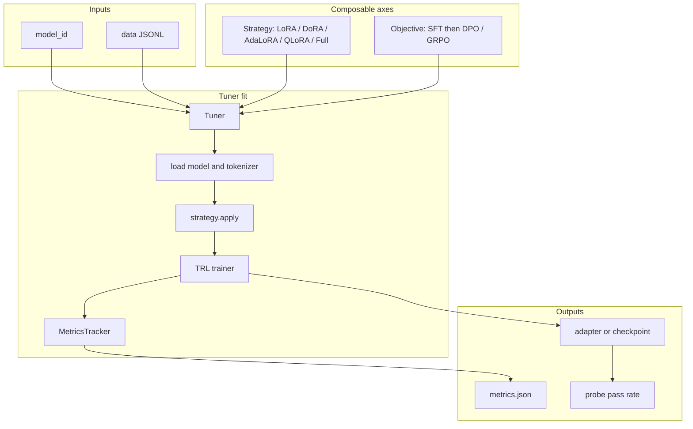

<div align="center">

[](https://github.com/slickml/slick-tune/actions/workflows/ci.yml)
[](https://codecov.io/gh/slickml/slick-tune)
[](https://pepy.tech/project/slicktune)
[](https://github.com/slickml/slick-tune/blob/master/LICENSE)


[](https://www.slickml.com/slack-invite)


</div>

<p align="center">
  <a href="https://github.com/slickml/slick-tune">
    
  </a>
</p>

<div align="center">
<h1 align="center">SlickTune 🧩: Composable LLM Fine-Tuning by SlickML🧞</h1>
  <p align="center">
    <a href="https://github.com/slickml/slick-tune/tree/master/docs"><b>📘 Docs</b></a>
    🟣
    <a href="https://github.com/slickml/slick-tune/blob/master/docs/pages/fine_tuning_guide.md"><b>Fine-Tuning Guide</b></a>
    🟣
    <a href="https://github.com/slickml/slick-tune/releases">Explore Releases</a>
    🟣
    <a href="https://github.com/slickml/slick-tune/blob/master/CONTRIBUTING.md">Become a Contributor</a>
    🟣
    <a href="https://pypi.org/project/slicktune/">PyPI</a>
    🟣
    <a href="https://www.slickml.com/slack-invite">Join our Slack</a>
    🟣
    <a href="https://twitter.com/slickml">Tweet Us</a>
  </p>
</div>

> **New to fine-tuning?** Start here →
> **[Fine-Tuning LLMs: A Visual Guide](docs/pages/fine_tuning_guide.md)** —
> pre-training vs prompting vs FT, Full / LoRA / DoRA / AdaLoRA / QLoRA with diagrams,
> how to choose a strategy, and how probes & holdout perplexity tell you it worked.
>
> Build the full Sphinx site locally (same pattern as [slick-ml/docs](https://github.com/slickml/slick-ml/tree/master/docs)):
> `uv sync --group docs && poe sphinx` → open `docs/_build/index.html`.

Fine-tuning is an orthogonal stack — swap any axis without rewriting the others:

```text
model  ×  strategy  ×  objective  ×  data  ×  metrics
```

## 🧠 Philosophy

**slick-tune** is a small, composable toolkit for teaching LLMs new facts and behaviors with
[Transformers](https://huggingface.co/docs/transformers) + [PEFT](https://huggingface.co/docs/peft) + [TRL](https://huggingface.co/docs/trl).
LoRA / QLoRA are PEFT adapters; full FT updates every weight. The goal is the same SlickML spirit:
prototype fast 🏎, keep axes orthogonal, and measure whether the model actually learned *your* facts 🔎.

## 🧩 Abstractions



| Axis          | Responsibility                    | Phase 2                                         |
| ------------- | --------------------------------- | ----------------------------------------------- |
| **Strategy**  | How weights change (PEFT vs full) | `LoRA` / `DoRA` / `AdaLoRA` / `QLoRA` / `Full`  |
| **Objective** | What is optimized / data contract | `SFTObjective` (DPO stubbed for Phase 3)        |
| **Data**      | Examples → chat `messages`        | train + holdout JSONL (`about_amir*.jsonl`)     |
| **Metrics**   | Comparable run stats              | `MetricsTracker` (+ holdout PPL, judge score)   |
| **Eval**      | Holdout + judges                  | `slicktune eval`, `SubstringJudge`, `LLMJudge` |
| **Probe**     | Did the model learn *your* facts? | `slicktune probe`                              |

## 📌 Quick Start

```python
from slicktune import LoRAStrategy, SFTObjective, Tuner

Tuner(
    model_id="HuggingFaceTB/SmolLM2-135M-Instruct",
    strategy=LoRAStrategy(r=8),
    objective=SFTObjective(),
    output_dir="outputs/sft_lora",
    eval_data="examples/data/about_amir.eval.jsonl",
).fit("examples/data/about_amir.jsonl")
```

### 👤 Personal “about me” loop (recommended)

1. Edit `examples/data/about_amir.jsonl` with facts about you (or keep the SlickML starter facts) ✍️.
2. Edit `examples/data/about_amir.eval.jsonl` with **held-out** paraphrases (same topics, not copied from train) for perplexity 📉.
3. Edit `examples/data/about_amir.probes.jsonl` with questions and a `must_contain` substring that should appear after training 🎯.
4. Train a strategy on a **tiny** instruct model 🧪.
5. Probe the checkpoint — pass rate shows whether fine-tuning stuck ✅.

```text
before FT  →  model guesses / hallucinates about you
after FT   →  probe answers contain your facts
```

## 🛠 Installation

Install [Python >=3.10,<3.13](https://www.python.org) and [*uv*](https://docs.astral.sh/uv/), then simply run 🏃‍♀️:

```bash
uv sync
```

QLoRA (CUDA + bitsandbytes only) 🔥:

```bash
uv sync --extra qlora
```

Task runner is [Poe the Poet](https://poethepoet.natn.io/installation.html) (same idea as [slick-ml](https://github.com/slickml/slick-ml), with `uv` instead of Poetry). Install the CLI once 🏃‍♀️:

```bash
uv tool install poethepoet
poe greet
```

Developer workflow (`format` / `check` / `test`) lives in [CONTRIBUTING.md](CONTRIBUTING.md) 🧑‍💻🤝.

## 🚂 Train each strategy

Default demo model: `HuggingFaceTB/SmolLM2-135M-Instruct` (small enough for laptop smoke tests) 💻.

### 🟢 LoRA + SFT (default — works on Mac MPS / CPU / CUDA)

```bash
uv run slicktune train \
  --strategy lora \
  --data examples/data/about_amir.jsonl \
  --eval-data examples/data/about_amir.eval.jsonl \
  --output outputs/sft_lora \
  --epochs 20

uv run slicktune probe \
  --model-dir outputs/sft_lora \
  --probes examples/data/about_amir.probes.jsonl
```

Or: `poe train-lora` / `poe probe-lora` / `poe eval-lora` / `uv run python examples/run_sft_lora.py`

### 🟣 DoRA + SFT

```bash
uv run slicktune train \
  --strategy dora \
  --data examples/data/about_amir.jsonl \
  --eval-data examples/data/about_amir.eval.jsonl \
  --output outputs/sft_dora
# or: uv run python examples/run_sft_dora.py
```

### 🟤 AdaLoRA + SFT

```bash
uv run slicktune train \
  --strategy adalora \
  --data examples/data/about_amir.jsonl \
  --eval-data examples/data/about_amir.eval.jsonl \
  --output outputs/sft_adalora
# or: uv run python examples/run_sft_adalora.py
```

### 🔎 Eval harness (holdout PPL + judges)

```bash
uv run slicktune eval \
  --model-dir outputs/sft_lora \
  --eval-data examples/data/about_amir.eval.jsonl \
  --probes examples/data/about_amir.probes.jsonl \
  --judge substring
```

`--eval-data` should be a **holdout** SFT JSONL (not the training file). The shipped
`about_amir.eval.jsonl` paraphrases the same topics for holdout perplexity.

Use `--judge llm` to score generations with an LLM rubric (0–10 → normalized).
On the tiny demo model, prefer `--judge substring`: the same 135M checkpoint is a
weak judge and will under-score even when answers are correct.

### 🔵 QLoRA + SFT (CUDA required)

```bash
uv sync --extra qlora
uv run python examples/run_sft_qlora.py
```

On Apple Silicon, use LoRA instead — bitsandbytes 4-bit needs CUDA 🍎.

### 🟠 Full fine-tuning + SFT

```bash
uv run python examples/run_sft_full.py
```

Heavier on memory; prefer LoRA for iteration 💾.

## 📦 Data formats

**SFT JSONL** (any of these per line) 📝:

```json
{"messages":[{"role":"user","content":"..."},{"role":"assistant","content":"..."}]}
{"prompt":"...","response":"..."}
{"instruction":"...","input":"...","output":"..."}
```

**Probe JSONL** 🕵️:

```json
{"prompt":"Who is Amirhessam Tahmassebi?","must_contain":"SlickML"}
```

**Holdout eval JSONL** (same SFT shapes as train; keep examples out of the train file) 📉:

```json
{"messages":[{"role":"user","content":"..."},{"role":"assistant","content":"..."}]}
```

Ship example: `examples/data/about_amir.eval.jsonl`.

## 🗺 Roadmap

| Phase   | Scope                                                         |
| ------- | ------------------------------------------------------------- |
| 0–1     | Skeleton, SFT + LoRA/QLoRA/full, metrics, personal probe loop |
| 2 (now) | DoRA / AdaLoRA, holdout PPL + substring/LLM judges            |
| 3       | DPO / ORPO / KTO                                              |
| 4       | GRPO / verifiable RL                                          |
| 5       | Merge (TIES/DARE), multi-adapter                              |
| 6       | Optional PPO / multimodal                                     |

## 🧑‍💻🤝 Contributing to SlickTune 🧩

You can find the details of the development process in our [Contributing](CONTRIBUTING.md) guidelines.
We strongly believe that reading and following these guidelines will help us make the contribution process easy and effective for everyone involved 🚀🌙.

Special thanks to all of our amazing contributors 👇

<a href="https://github.com/slickml/slick-tune/graphs/contributors">
  
</a>


## ❓ 🆘 📲 Need Help?

Please join our [Slack Channel](https://www.slickml.com/slack-invite) to interact directly with the core team and our small community. This is a good place to discuss your questions and ideas or in general ask for help 👨‍👩‍👧 👫 👨‍👩‍👦.
