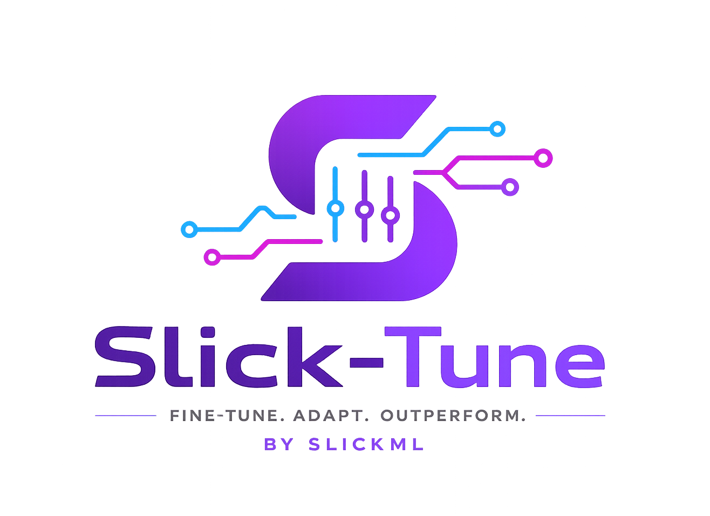
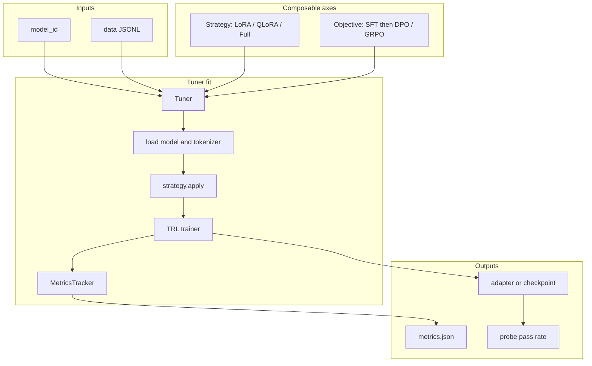

<p align="center">
  
</p>

# SlickTune 🧩: Composable LLM fine-tuning by [SlickML](https://github.com/slickml)


Fine-tuning is an orthogonal stack — swap any axis without rewriting the others:

```text
model  ×  strategy  ×  objective  ×  data  ×  metrics
```

## 🧠 Philosophy

**slick-tune** is a small, composable toolkit for teaching LLMs new facts and behaviors with
[Transformers](https://huggingface.co/docs/transformers) + [PEFT](https://huggingface.co/docs/peft) + [TRL](https://huggingface.co/docs/trl).
LoRA / QLoRA are PEFT adapters; full FT updates every weight. The goal is the same SlickML spirit:
prototype fast 🏎, keep axes orthogonal, and measure whether the model actually learned *your* facts 🔎.

## 🧩 Abstractions



| Axis          | Responsibility                    | Phase 1                                         |
| ------------- | --------------------------------- | ----------------------------------------------- |
| **Strategy**  | How weights change (PEFT vs full) | `LoRAStrategy`, `QLoRAStrategy`, `FullStrategy` |
| **Objective** | What is optimized / data contract | `SFTObjective` (DPO stubbed)                    |
| **Data**      | Examples → chat `messages`        | `load_sft_jsonl`                                |
| **Metrics**   | Comparable run stats              | `MetricsTracker`                                |
| **Probe**     | Did the model learn *your* facts? | `slick-tune probe`                              |

## 📌 Quick Start

```python
from slicktune import LoRAStrategy, SFTObjective, Tuner

Tuner(
    model_id="HuggingFaceTB/SmolLM2-135M-Instruct",
    strategy=LoRAStrategy(r=8),
    objective=SFTObjective(),
    output_dir="outputs/sft_lora",
).fit("examples/data/about_amir.jsonl")
```

### 👤 Personal “about me” loop (recommended)

1. Edit `examples/data/about_amir.jsonl` with facts about you (or keep the SlickML starter facts) ✍️.
2. Edit `examples/data/about_amir.probes.jsonl` with questions and a `must_contain` substring that should appear after training 🎯.
3. Train a strategy on a **tiny** instruct model 🧪.
4. Probe the checkpoint — pass rate shows whether fine-tuning stuck ✅.

```text
before FT  →  model guesses / hallucinates about you
after FT   →  probe answers contain your facts
```

## 🛠 Installation

Install [Python >=3.10,<3.13](https://www.python.org) and [*uv*](https://docs.astral.sh/uv/), then simply run 🏃‍♀️:

```bash
uv sync
```

QLoRA (CUDA + bitsandbytes only) 🔥:

```bash
uv sync --extra qlora
```

Task runner is [Poe the Poet](https://poethepoet.natn.io/installation.html) (same idea as [slick-ml](https://github.com/slickml/slick-ml), with `uv` instead of Poetry). Install the CLI once 🏃‍♀️:

```bash
uv tool install poethepoet
poe greet
```

Developer workflow (`format` / `check` / `test`) lives in [CONTRIBUTING.md](CONTRIBUTING.md) 🧑‍💻🤝.

## 🚂 Train each strategy

Default demo model: `HuggingFaceTB/SmolLM2-135M-Instruct` (small enough for laptop smoke tests) 💻.

### 🟢 LoRA + SFT (default — works on Mac MPS / CPU / CUDA)

```bash
uv run slick-tune train \
  --strategy lora \
  --data examples/data/about_amir.jsonl \
  --output outputs/sft_lora \
  --epochs 20

uv run slick-tune probe \
  --model-dir outputs/sft_lora \
  --probes examples/data/about_amir.probes.jsonl
```

Or: `poe train-lora` / `poe probe-lora` / `uv run python examples/run_sft_lora.py`

### 🔵 QLoRA + SFT (CUDA required)

```bash
uv sync --extra qlora
uv run python examples/run_sft_qlora.py
```

On Apple Silicon, use LoRA instead — bitsandbytes 4-bit needs CUDA 🍎.

### 🟠 Full fine-tuning + SFT

```bash
uv run python examples/run_sft_full.py
```

Heavier on memory; prefer LoRA for iteration 💾.

## 📦 Data formats

**SFT JSONL** (any of these per line) 📝:

```json
{"messages":[{"role":"user","content":"..."},{"role":"assistant","content":"..."}]}
{"prompt":"...","response":"..."}
{"instruction":"...","input":"...","output":"..."}
```

**Probe JSONL** 🕵️:

```json
{"prompt":"Who is Amirhessam Tahmassebi?","must_contain":"SlickML"}
```

## 🗺 Roadmap

| Phase     | Scope                                                         |
| --------- | ------------------------------------------------------------- |
| 0–1 (now) | Skeleton, SFT + LoRA/QLoRA/full, metrics, personal probe loop |
| 2         | DoRA / AdaLoRA, richer eval                                   |
| 3         | DPO / ORPO / KTO                                              |
| 4         | GRPO / verifiable RL                                          |
| 5         | Merge (TIES/DARE), multi-adapter                              |
| 6         | Optional PPO / multimodal                                     |

## 🧑‍💻🤝 Contributing to slick-tune

You can find the details of the development process in our [Contributing](CONTRIBUTING.md) guidelines.
We strongly believe that reading and following these guidelines will help us make the contribution process easy and effective for everyone involved 🚀🌙.

Conventions in short: **`@dataclass` classes**, **numpydoc** docstrings, full type hints via **ruff** (`ANN`) + **mypy**, **assertpy** in tests (see `.cursor/rules/`).

## ❓ 🆘 📲 Need Help?

Please join our [Slack Channel](https://www.slickml.com/slack-invite) to interact directly with the core team and our small community. This is a good place to discuss your questions and ideas or in general ask for help 👨‍👩‍👧 👫 👨‍👩‍👦.
