# 🎨 Fine-Tuning LLMs: A Visual Guide

A beginner-friendly tour of **what fine-tuning is**, **why PEFT exists**, and **every parameter strategy** shipped in [slick-tune](https://github.com/slickml/slick-tune): Full FT, LoRA, DoRA, AdaLoRA, and QLoRA.

No prior ML background required — diagrams first, math second, then how it maps to slick-tune. 🚀

---

## 📚 Table of contents

1. [🗺️ The big picture](#1-the-big-picture)
2. [🥊 Pre-training vs prompting vs fine-tuning](#2-pre-training-vs-prompting-vs-fine-tuning)
3. [⚙️ What actually changes when you fine-tune?](#3-what-actually-changes-when-you-fine-tune)
4. [💡 Why not always update every weight?](#4-why-not-always-update-every-weight)
5. [🧭 Strategy overview](#5-strategy-overview)
6. [🏋️ Full fine-tuning](#6-full-fine-tuning)
7. [🧩 LoRA](#7-lora-low-rank-adaptation)
8. [✨ DoRA](#8-dora-weight-decomposed-lora)
9. [🎯 AdaLoRA](#9-adalora-adaptive-rank-lora)
10. [📦 QLoRA](#10-qlora-quantized-lora)
11. [🗳️ Choosing a strategy](#11-choosing-a-strategy)
12. [🎓 Objectives: what the model learns](#12-objectives-what-the-model-learns)
13. [🧪 Did it work? Probes, holdout PPL, judges](#13-did-it-work-probes-holdout-ppl-judges)
14. [🔌 How slick-tune wires this together](#14-how-slick-tune-wires-this-together)
15. [📖 Glossary](#15-glossary)
16. [🔗 Further reading](#16-further-reading)

---

## 1. 🗺️ The big picture

A large language model (LLM) is a giant function: **text in → next-token probabilities out**.
Those probabilities come from **billions of numbers** called **weights** (or parameters).

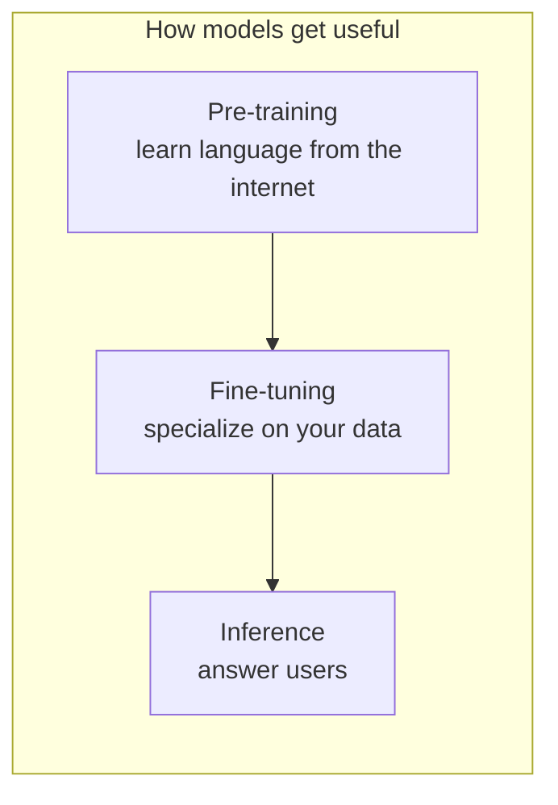

**Fine-tuning** means: take an already-trained model and **continue training** on a smaller, task-specific dataset so it behaves the way *you* want — for example, answering questions about your product, your company, or (in slick-tune’s demo) Amirhessam / SlickML.

slick-tune treats fine-tuning as five **orthogonal axes**:

```text
model  ×  strategy  ×  objective  ×  data  ×  metrics
```

| Axis | Question it answers |
|------|---------------------|
| **🧠 model** | Which base checkpoint? (`SmolLM2`, Llama, …) |
| **🧩 strategy** | *How* do weights change? (LoRA, QLoRA, full, …) |
| **🎓 objective** | *What* loss / data contract? (SFT, DPO, ORPO, KTO) |
| **📁 data** | Which examples? (train JSONL + optional holdout) |
| **📊 metrics** | Did it learn? (loss, PPL, probes, judges) |

You can swap one axis without rewriting the others — that is the whole point of the library.

---

## 2. 🥊 Pre-training vs prompting vs fine-tuning

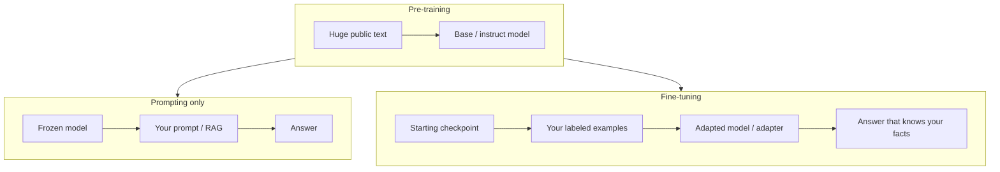

| Approach | Weights change? | Good for | Limit |
|----------|-----------------|----------|--------|
| **Prompting / RAG** | No | Quick demos, docs lookup | Context length; model may still hallucinate your facts |
| **Fine-tuning** | Yes (all or adapters) | Teaching stable facts/style/format | Needs data + compute; can overfit |
| **Pre-training** | Yes, from scratch / continued | New domains at web scale | Extremely expensive |

**👍 Rule of thumb:** if you need the model to *reliably* know something small and personal (names, emails, product APIs), fine-tuning + **probes** beats hoping the prompt sticks.

---

## 3. ⚙️ What actually changes when you fine-tune?

Inside a Transformer, most compute is **linear layers**: matrices that mix features.

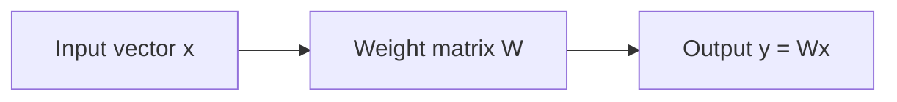

During fine-tuning we compute a **loss** (how wrong the next-token predictions were), then **backpropagation** produces a **gradient** for each trainable weight: “nudge this number up or down.”

An **optimizer** (usually AdamW) applies those nudges for many steps. After enough steps, the model’s distribution shifts toward your data.

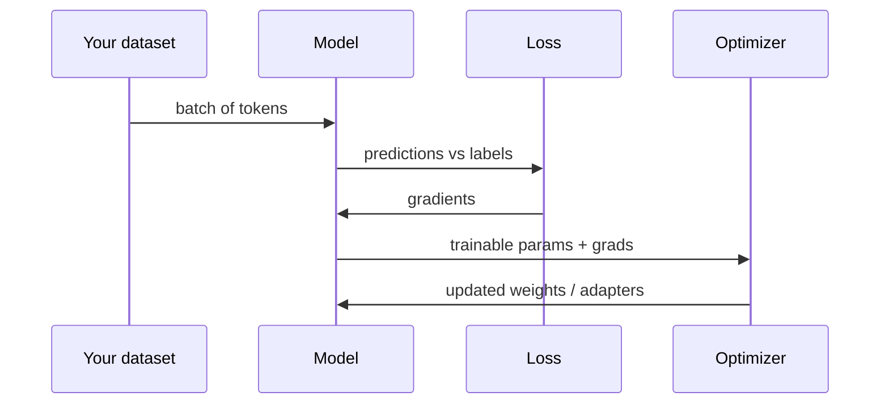

---

## 4. 💡 Why not always update every weight?

Updating **all** weights (**full fine-tuning**) works, but:

- Needs a lot of **GPU memory** (weights + gradients + optimizer states ≈ several× model size).
- Produces a **full copy** of the model per run (hard to share many variants).
- Easy to **catastrophically forget** general skills if data is tiny.

**Parameter-Efficient Fine-Tuning (PEFT)** freezes the base model and trains a small add-on (**adapter**). The most popular adapter family is **LoRA**.

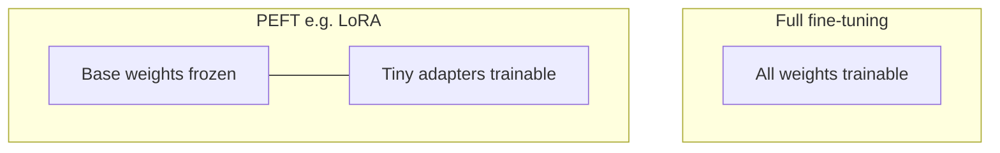

| | Full FT | PEFT (LoRA-like) |
|--|---------|------------------|
| Trainable params | ~100% | Often **&lt;1–5%** |
| Checkpoint size | Entire model | Small adapter files |
| Multi-task serving | Heavy | Swap adapters on one base |
| Quality ceiling | Highest in theory | Usually close for many tasks |

---

## 5. 🧭 Strategy overview

slick-tune strategies answer: **how do we change weights?**

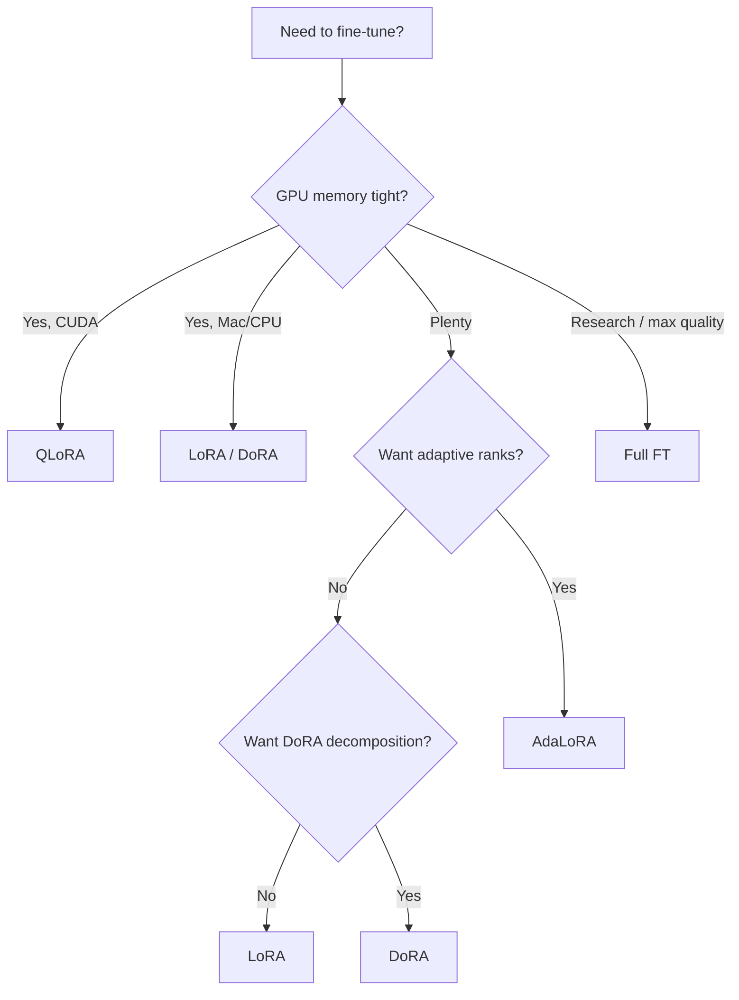

| Strategy | Idea in one sentence | slick-tune class |
|----------|----------------------|------------------|
| **🏋️ Full** | Train every parameter | `FullStrategy` |
| **🧩 LoRA** | Freeze \(W\); train low-rank \(A,B\) | `LoRAStrategy` |
| **✨ DoRA** | LoRA + separate magnitude / direction | `DoRAStrategy` |
| **🎯 AdaLoRA** | Start higher rank; prune toward a budget | `AdaLoRAStrategy` |
| **📦 QLoRA** | 4-bit frozen base + LoRA on top | `QLoRAStrategy` |

---

## 6. 🏋️ Full fine-tuning

**💡 Idea:** every weight that can learn, learns.

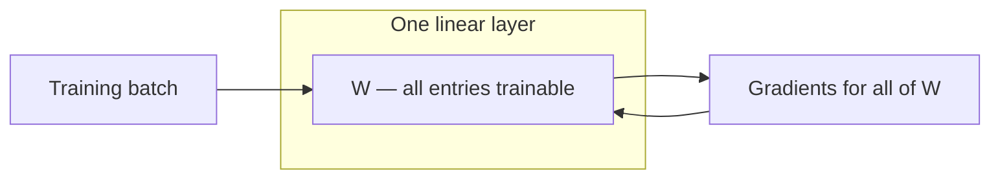

**✅ When to use**

- Small base models where memory allows (slick-tune’s SmolLM demos).
- You need maximum capacity and will keep one specialized checkpoint.

**⚖️ Trade-offs**

- Highest memory and storage cost.
- One run → one full model directory (not a tiny adapter).

**🧑‍💻 In slick-tune:**

```python
from slicktune import FullStrategy, SFTObjective, Tuner

Tuner(
    model_id="HuggingFaceTB/SmolLM2-135M-Instruct",
    strategy=FullStrategy(),
    objective=SFTObjective(),
    output_dir="outputs/sft_full",
).fit("examples/data/about_amir.jsonl")
```

---

## 7. 🧩 LoRA (Low-Rank Adaptation)

### 💭 Intuition

Instead of updating a huge matrix \(W\), keep \(W\) **frozen** and learn a **small correction**:

\[
W' = W + \Delta W, \quad \Delta W = \frac{\alpha}{r}\, B A
\]

- \(A\) is \(r \times d_{\text{in}}\) (often started random / Gaussian).
- \(B\) is \(d_{\text{out}} \times r\) (often started at **zero**, so training begins as “no change”).
- \(r\) (**rank**) is tiny (e.g. 8 or 16) vs thousands of hidden dims.
- \(\alpha\) (**alpha**) scales the update; people often set \(\alpha \approx 2r\).

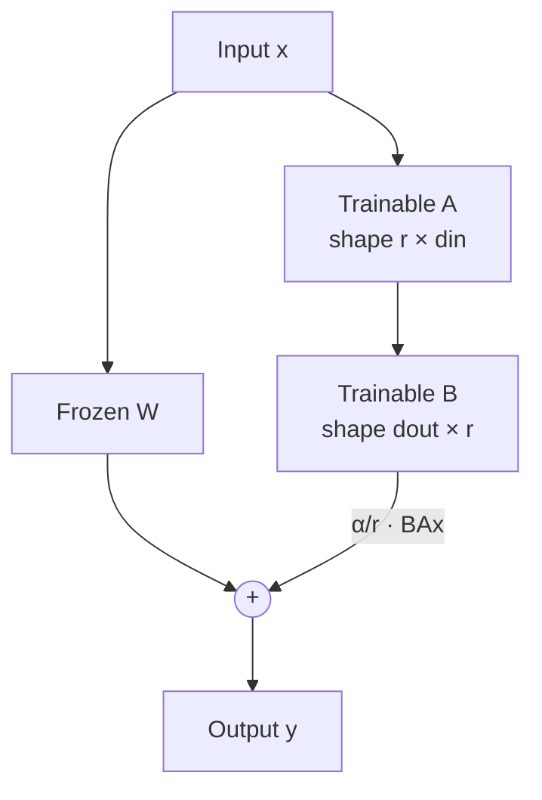

**Why “low-rank”?** Empirically, the useful change \(\Delta W\) often lives in a low-dimensional subspace — so a thin \(BA\) is enough for many adaptations.

### 📍 Where adapters attach

LoRA is usually injected into **attention / MLP linear projections** (`q_proj`, `v_proj`, …). slick-tune defaults to `target_modules="all-linear"` so PEFT discovers linear layers for you.

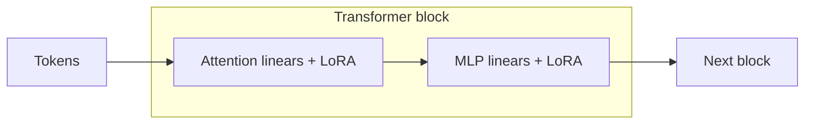

### 🚀 Serving

After training you typically have:

- the **base model** (unchanged), and
- a small **adapter** folder (`adapter_model.safetensors`, `adapter_config.json`).

At inference: load base + adapter, or **merge** adapter into \(W\) for engines that want a single set of weights.

### 🎛️ Knobs that matter

| Knob | Meaning | Typical start |
|------|---------|---------------|
| `r` | Rank / capacity of \(\Delta W\) | 8–64 |
| `alpha` | Strength of update | \(2r\) |
| `dropout` | Regularize adapters | 0.05 |
| `target_modules` | Which layers get LoRA | `"all-linear"` or attention-only |

```python
from slicktune import LoRAStrategy

LoRAStrategy(r=16, alpha=32, dropout=0.05)
```

---

## 8. ✨ DoRA (Weight-Decomposed LoRA)

### 💭 Intuition

Full fine-tuning changes both **how large** a weight row is (**magnitude**) and **which direction** it points. Plain LoRA mostly learns a directional update on top of frozen \(W\).

**DoRA** decomposes the adapted weight into:

- a **magnitude** vector \(m\), and
- a **direction** component updated with a LoRA-style low-rank term.

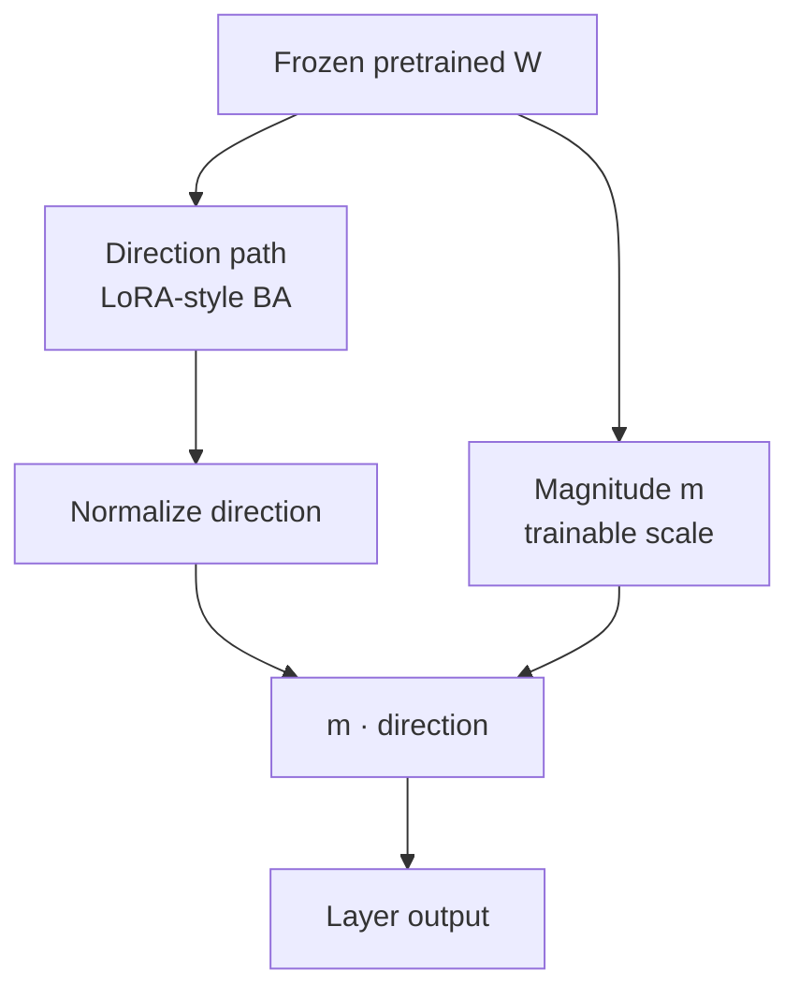

**Same knobs as LoRA** (`r`, `alpha`, …) plus `use_dora=True` under the hood in PEFT.

**✅ When to try DoRA**

- You like LoRA’s cost but want a bit more quality headroom.
- Slightly more compute than LoRA; still PEFT-cheap vs full FT.

```python
from slicktune import DoRAStrategy

DoRAStrategy(r=16, alpha=32)
```

---

## 9. 🎯 AdaLoRA (Adaptive-rank LoRA)

### 💭 Intuition

Not every layer needs the same rank. **AdaLoRA**:

1. Starts with a higher **initial rank** (`init_r`).
2. Scores parameter importance during training.
3. **Prunes** toward an average **target rank** (`target_r`).
4. Uses a schedule: warmup (`tinit`) → allocate/prune (`deltaT`) → final fine-tune (`tfinal`).

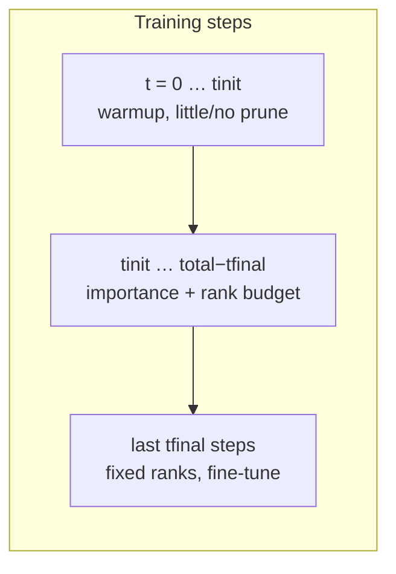

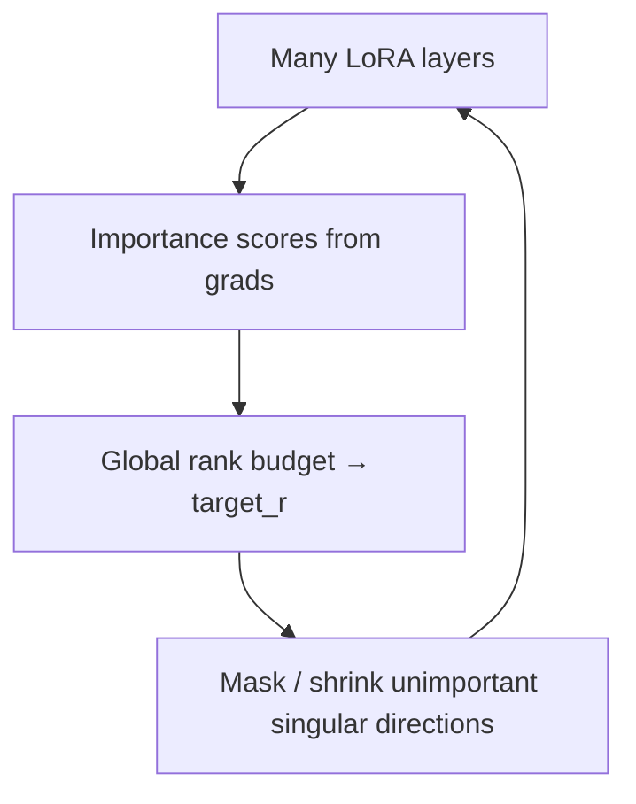

**⚠️ Critical detail:** PEFT’s `update_and_allocate` must run **after** `optimizer.step()` and **before** `zero_grad()` (gradients must still exist). slick-tune’s `AdaLoRACallback` hooks Hugging Face Trainer’s `on_optimizer_step` for this.

**✅ When to try AdaLoRA**

- Longer runs where adaptive capacity might help.
- Tiny memorization demos often need **warmup** (`tinit`) + slightly higher LR than LoRA — see `examples/run_sft_adalora.py`.

```python
from slicktune import AdaLoRAStrategy

AdaLoRAStrategy(init_r=16, target_r=12, tinit=60, tfinal=30, deltaT=5)
```

---

## 10. 📦 QLoRA (Quantized LoRA)

### 💭 Intuition

**QLoRA** keeps a **4-bit quantized** copy of the base weights in memory (NF4 + double quant in the common setup), computes in a higher precision (e.g. bfloat16), and still trains **LoRA adapters** in higher precision.

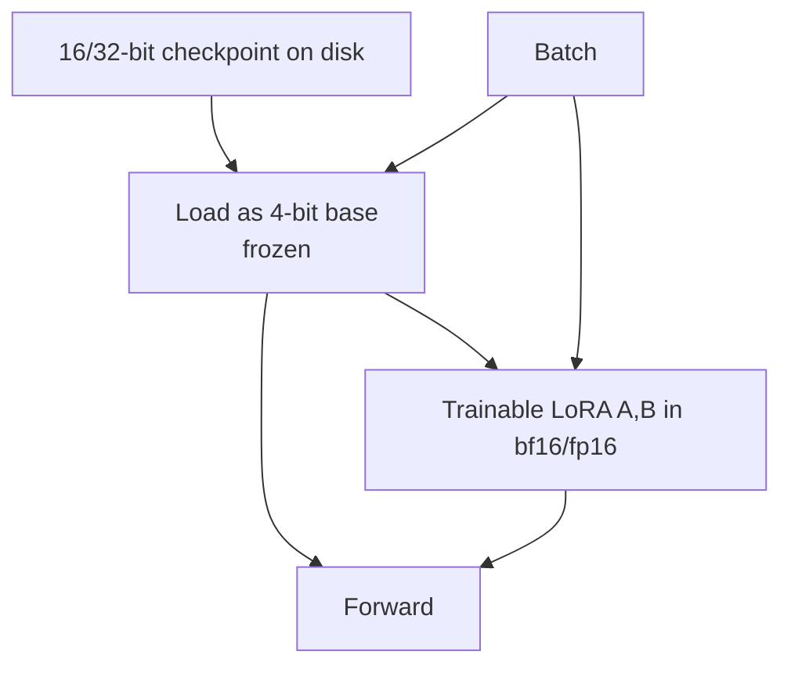

**🤔 Why it exists:** fine-tune **larger** models on **smaller GPUs** by shrinking the memory footprint of the frozen base.

**📋 Requirements in slick-tune**

- **CUDA** GPU (bitsandbytes 4-bit path).
- Extra install: `uv sync --extra qlora`.
- On Apple Silicon / CPU → use **LoRA**, not QLoRA.

```python
from slicktune import QLoRAStrategy

QLoRAStrategy(r=16, alpha=32)
```

---

## 11. 🗳️ Choosing a strategy

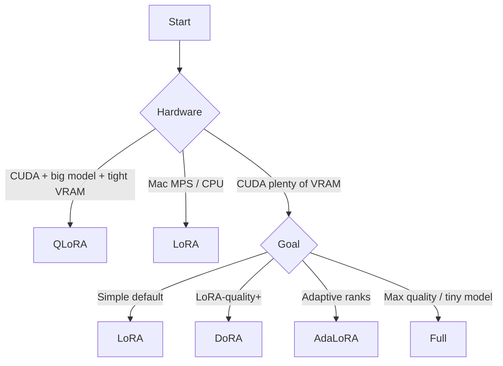

| Situation | Prefer |
|-----------|--------|
| Laptop smoke test (Mac) | **LoRA** (or DoRA) |
| First serious PEFT run | **LoRA** |
| Want LoRA-like cost, try better quality | **DoRA** |
| Long run, explore rank budgets | **AdaLoRA** |
| 7B+ on a single consumer GPU | **QLoRA** |
| Small model, memory OK, one final specialist | **Full** |

**🔁 Orthogonal reminder:** strategy ≠ objective. You can run **LoRA + SFT** today and later **LoRA + DPO** without changing the adapter idea.

---

## 12. 🎓 Objectives: what the model learns

| Objective | Data shape | Loss idea | Phase |
|-----------|------------|-----------|-------|
| **SFT** | instruction → response (chat `messages`) | Next-token NLL on the answer | Phase 1–2 |
| **DPO / ORPO / KTO** | preferred vs rejected (or unpaired KTO labels) | Preference optimization | Phase 3 (now) |
| **GRPO / RL** | prompts + rewards | Policy improvement | Phase 4+ |

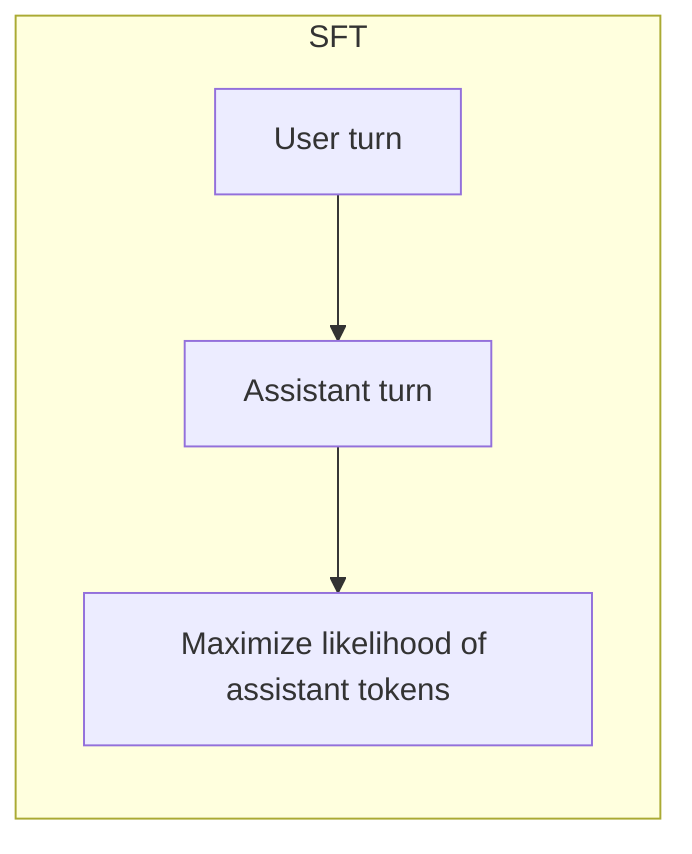

slick-tune’s `SFTObjective` expects a dataset with a `messages` column (JSONL loaders also accept `prompt`/`response` and `instruction`/`output`).

---

## 13. 🧪 Did it work? Probes, holdout PPL, judges

Fine-tuning can lower **training loss** while still failing your real goal. Measure explicitly: 📏

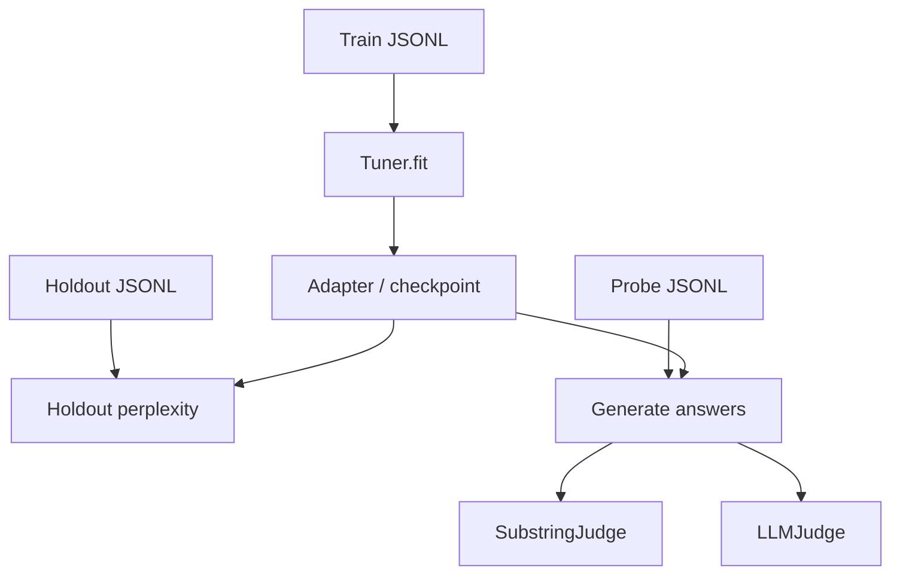

| Signal | Asks | Good when |
|--------|------|-----------|
| **Train loss** | Did optimization move? | Downward trend |
| **Holdout perplexity** | How surprising is *unseen* text? | Lower PPL on `*.eval.jsonl` |
| **Probes + substring judge** | Does the answer contain your fact? | High pass rate |
| **LLM judge** | Rubric score 0–10 | Stronger judge model; weak on tiny self-judges |

**Perplexity** \(= e^{\text{mean NLL}}\). Intuition: effective branching factor for next tokens — **lower is better**.

**📁 Shipped demo files:**

| File | Role |
|------|------|
| `examples/data/about_amir.jsonl` | 🏋️ Train |
| `examples/data/about_amir.eval.jsonl` | 📉 Holdout PPL |
| `examples/data/about_amir.probes.jsonl` | ✅ Fact checks |

---

## 14. 🔌 How slick-tune wires this together

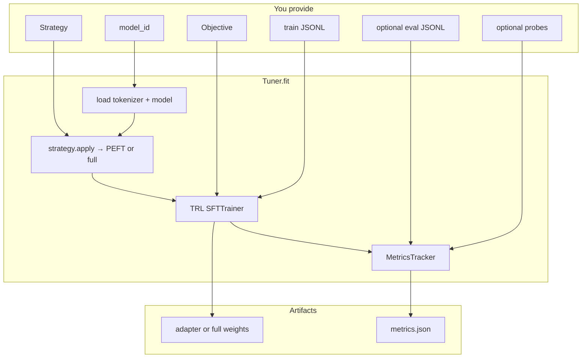

**⌨️ CLI shortcuts:**

```bash
# 🏋️ Train
uv run slicktune train --strategy lora \
  --data examples/data/about_amir.jsonl \
  --eval-data examples/data/about_amir.eval.jsonl \
  --output outputs/sft_lora

# 🧪 Probes
uv run slicktune probe \
  --model-dir outputs/sft_lora \
  --probes examples/data/about_amir.probes.jsonl

# 📊 Holdout PPL + judges
uv run slicktune eval \
  --model-dir outputs/sft_lora \
  --eval-data examples/data/about_amir.eval.jsonl \
  --probes examples/data/about_amir.probes.jsonl \
  --judge substring
```

---

## 15. 📖 Glossary

| Term | Meaning |
|------|---------|
| **Weight / parameter** | A learned number inside the model |
| **Gradient** | Direction to change a weight to reduce loss |
| **Adapter / PEFT** | Small trainable module; base frozen |
| **Rank \(r\)** | Inner dimension of LoRA’s \(A,B\) |
| **Alpha \(\alpha\)** | Scales LoRA update |
| **Quantization** | Store weights in fewer bits (e.g. 4-bit) |
| **SFT** | Supervised fine-tuning on input→output demos |
| **Holdout** | Eval data **not** used for training steps |
| **Perplexity (PPL)** | \(\exp(\text{mean token NLL})\); lower = better fit |
| **Probe** | Question + required substring to verify learning |
| **Merge** | Bake LoRA \(\Delta W\) into \(W\) for single-file serving |

---

## 16. 🔗 Further reading

- 📄 LoRA paper: [Low-Rank Adaptation of Large Language Models](https://arxiv.org/abs/2106.09685)
- 📄 QLoRA: [QLoRA: Efficient Finetuning of Quantized LLMs](https://arxiv.org/abs/2305.14314)
- 📄 DoRA: [Weight-Decomposed Low-Rank Adaptation](https://arxiv.org/abs/2402.09353)
- 📄 AdaLoRA: [Adaptive Budget Allocation for Parameter-Efficient Fine-Tuning](https://arxiv.org/abs/2303.10512)
- 🤗 Hugging Face PEFT docs: https://huggingface.co/docs/peft
- 🧞 slick-tune README: https://github.com/slickml/slick-tune

---

*🧞 Maintained with slick-tune — swap strategy, keep the rest of the stack.*
