# 🎨 Fine-Tuning LLMs: A Visual Guide

A beginner-friendly tour of **what fine-tuning is**, **why PEFT exists**, and **every parameter strategy** shipped in [slick-tune](https://github.com/slickml/slick-tune): Full FT, LoRA, DoRA, AdaLoRA, and QLoRA — plus **multi-adapter merge** (TIES / DARE) after training.

No prior ML background required — diagrams first, math second, then how it maps to slick-tune. 🚀

---

## 📚 Table of contents

1. [🗺️ The big picture](#1-the-big-picture)
2. [🥊 Pre-training vs prompting vs fine-tuning](#2-pre-training-vs-prompting-vs-fine-tuning)
3. [⚙️ What actually changes when you fine-tune?](#3-what-actually-changes-when-you-fine-tune)
4. [💡 Why not always update every weight?](#4-why-not-always-update-every-weight)
5. [🧭 Strategy overview](#5-strategy-overview)
6. [🏋️ Full fine-tuning](#6-full-fine-tuning)
7. [🧩 LoRA](#7-lora-low-rank-adaptation)
8. [✨ DoRA](#8-dora-weight-decomposed-lora)
9. [🎯 AdaLoRA](#9-adalora-adaptive-rank-lora)
10. [📦 QLoRA](#10-qlora-quantized-lora)
11. [🗳️ Choosing a strategy](#11-choosing-a-strategy)
12. [🎓 Objectives: what the model learns](#12-objectives-what-the-model-learns)
13. [🧪 Did it work? Probes, holdout PPL, judges](#13-did-it-work-probes-holdout-ppl-judges)
14. [🔀 Multi-adapter merge (TIES / DARE)](#14-multi-adapter-merge-ties--dare)
15. [🔌 How slick-tune wires this together](#15-how-slick-tune-wires-this-together)
16. [📖 Glossary](#16-glossary)
17. [🔗 Further reading](#17-further-reading)

---

## 1. 🗺️ The big picture

A large language model (LLM) is a giant function: **text in → next-token probabilities out**.
Those probabilities come from **billions of numbers** called **weights** (or parameters).

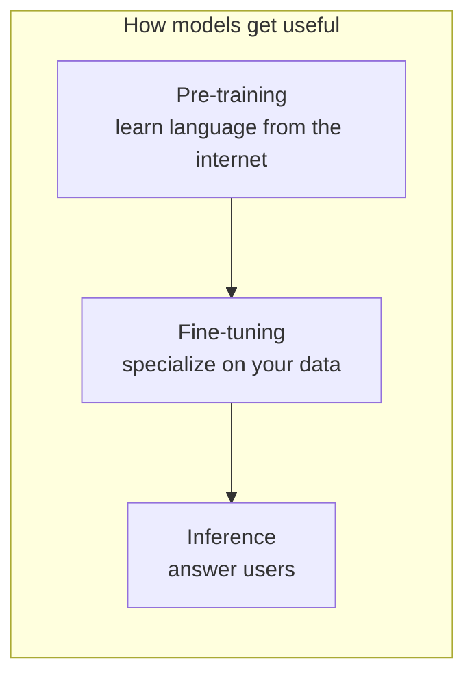
```mermaid
flowchart LR
  subgraph world [How models get useful]
    PT[Pre-training<br/>learn language from the internet]
    FT[Fine-tuning<br/>specialize on your data]
    USE[Inference<br/>answer users]
  end
  PT --> FT --> USE
```

**Fine-tuning** means: take an already-trained model and **continue training** on a smaller, task-specific dataset so it behaves the way *you* want — for example, answering questions about your product, your company, or (in slick-tune’s demo) Amirhessam / SlickML.

slick-tune treats fine-tuning as five **orthogonal axes**:

```text
model  ×  strategy  ×  objective  ×  data  ×  metrics
```

| Axis | Question it answers |
|------|---------------------|
| **🧠 model** | Which base checkpoint? (`SmolLM2`, Llama, …) |
| **🧩 strategy** | *How* do weights change? (LoRA, QLoRA, full, …) |
| **🎓 objective** | *What* loss / data contract? (SFT, DPO, ORPO, KTO, GRPO) |
| **📁 data** | Which examples? (train JSONL + optional holdout / prefs / rewards) |
| **📊 metrics** | Did it learn? (loss, PPL, probes, judges) |

After training you can also **merge** adapters (TIES / DARE) or **bake** them for serving — see [§14](#14-multi-adapter-merge-ties--dare).

You can swap one axis without rewriting the others — that is the whole point of the library.

---

## 2. 🥊 Pre-training vs prompting vs fine-tuning

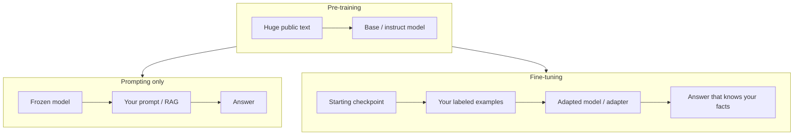
```mermaid
flowchart TB
  subgraph pt [Pre-training]
    Huge[Huge public text]
    Base[Base / instruct model]
    Huge --> Base
  end

  subgraph prompt [Prompting only]
    Base2[Frozen model]
    Prompt[Your prompt / RAG]
    Out1[Answer]
    Base2 --> Prompt --> Out1
  end

  subgraph ft [Fine-tuning]
    Base3[Starting checkpoint]
    Data[Your labeled examples]
    New[Adapted model / adapter]
    Out2[Answer that knows your facts]
    Base3 --> Data --> New --> Out2
  end

  pt --> prompt
  pt --> ft
```

| Approach | Weights change? | Good for | Limit |
|----------|-----------------|----------|--------|
| **Prompting / RAG** | No | Quick demos, docs lookup | Context length; model may still hallucinate your facts |
| **Fine-tuning** | Yes (all or adapters) | Teaching stable facts/style/format | Needs data + compute; can overfit |
| **Pre-training** | Yes, from scratch / continued | New domains at web scale | Extremely expensive |

**👍 Rule of thumb:** if you need the model to *reliably* know something small and personal (names, emails, product APIs), fine-tuning + **probes** beats hoping the prompt sticks.

---

## 3. ⚙️ What actually changes when you fine-tune?

Inside a Transformer, most compute is **linear layers**: matrices that mix features.

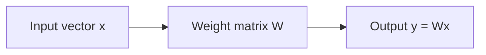
```mermaid
flowchart LR
  x[Input vector x] --> W["Weight matrix W"]
  W --> y[Output y = Wx]
```

During fine-tuning we compute a **loss** (how wrong the next-token predictions were), then **backpropagation** produces a **gradient** for each trainable weight: “nudge this number up or down.”

An **optimizer** (usually AdamW) applies those nudges for many steps. After enough steps, the model’s distribution shifts toward your data.

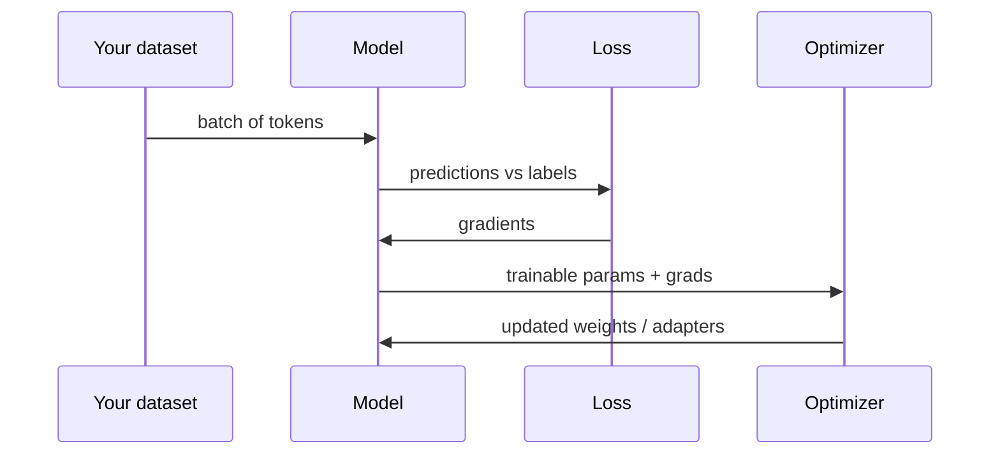
```mermaid
sequenceDiagram
  participant D as Your dataset
  participant M as Model
  participant L as Loss
  participant O as Optimizer
  D->>M: batch of tokens
  M->>L: predictions vs labels
  L->>M: gradients
  M->>O: trainable params + grads
  O->>M: updated weights / adapters
```

---

## 4. 💡 Why not always update every weight?

Updating **all** weights (**full fine-tuning**) works, but:

- Needs a lot of **GPU memory** (weights + gradients + optimizer states ≈ several× model size).
- Produces a **full copy** of the model per run (hard to share many variants).
- Easy to **catastrophically forget** general skills if data is tiny.

**Parameter-Efficient Fine-Tuning (PEFT)** freezes the base model and trains a small add-on (**adapter**). The most popular adapter family is **LoRA**.

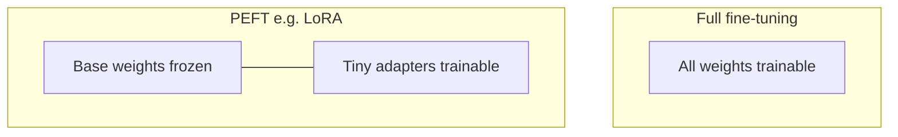
```mermaid
flowchart TB
  subgraph full [Full fine-tuning]
    W1[All weights trainable]
  end
  subgraph peft [PEFT e.g. LoRA]
    WF[Base weights frozen]
    A[Tiny adapters trainable]
    WF --- A
  end
```

| | Full FT | PEFT (LoRA-like) |
|--|---------|------------------|
| Trainable params | ~100% | Often under **1–5%** |
| Checkpoint size | Entire model | Small adapter files |
| Multi-task serving | Heavy | Swap adapters on one base |
| Quality ceiling | Highest in theory | Usually close for many tasks |

---

## 5. 🧭 Strategy overview

slick-tune strategies answer: **how do we change weights?**

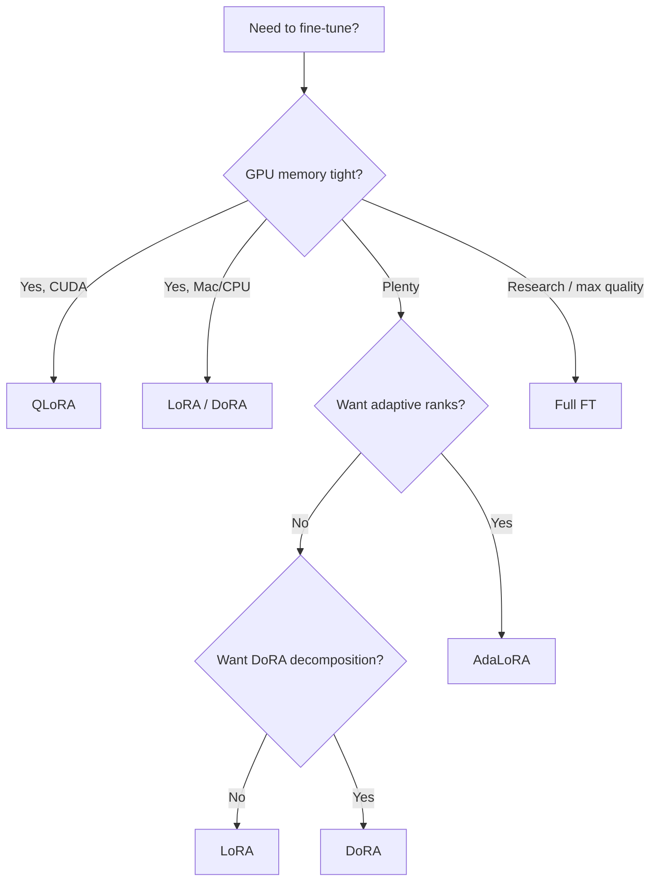
```mermaid
flowchart TB
  Start[Need to fine-tune?] --> Mem{GPU memory tight?}
  Mem -->|Yes, CUDA| Q[QLoRA]
  Mem -->|Yes, Mac/CPU| L[LoRA / DoRA]
  Mem -->|Plenty| Choice{Want adaptive ranks?}
  Choice -->|No| Fixed{Want DoRA decomposition?}
  Fixed -->|No| L2[LoRA]
  Fixed -->|Yes| D[DoRA]
  Choice -->|Yes| AD[AdaLoRA]
  Mem -->|Research / max quality| F[Full FT]
```

| Strategy | Idea in one sentence | slick-tune class |
|----------|----------------------|------------------|
| **🏋️ Full** | Train every parameter | `FullStrategy` |
| **🧩 LoRA** | Freeze \(W\); train low-rank \(A,B\) | `LoRAStrategy` |
| **✨ DoRA** | LoRA + separate magnitude / direction | `DoRAStrategy` |
| **🎯 AdaLoRA** | Start higher rank; prune toward a budget | `AdaLoRAStrategy` |
| **📦 QLoRA** | 4-bit frozen base + LoRA on top | `QLoRAStrategy` |

---

## 6. 🏋️ Full fine-tuning

**💡 Idea:** every weight that can learn, learns.

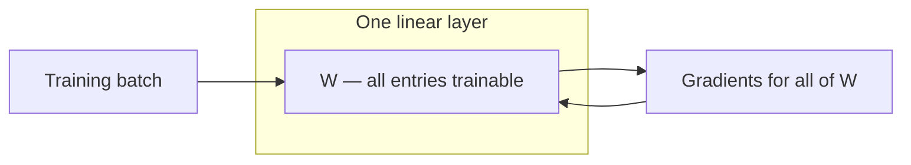
```mermaid
flowchart LR
  subgraph layer [One linear layer]
    W["W — all entries trainable"]
  end
  Batch[Training batch] --> W
  W --> Grad[Gradients for all of W]
  Grad --> W
```

**✅ When to use**

- Small base models where memory allows (slick-tune’s SmolLM demos).
- You need maximum capacity and will keep one specialized checkpoint.

**⚖️ Trade-offs**

- Highest memory and storage cost.
- One run → one full model directory (not a tiny adapter).

**🧑‍💻 In slick-tune:**

```python
from slicktune import FullStrategy, SFTObjective, Tuner

Tuner(
    model_id="HuggingFaceTB/SmolLM2-135M-Instruct",
    strategy=FullStrategy(),
    objective=SFTObjective(),
    output_dir="outputs/sft_full",
).fit("examples/data/about_amir.jsonl")
```

---

## 7. 🧩 LoRA (Low-Rank Adaptation)

### 💭 Intuition

Instead of updating a huge matrix \(W\), keep \(W\) **frozen** and learn a **small correction**:

\[
W' = W + \Delta W, \quad \Delta W = \frac{\alpha}{r}\, B A
\]

- \(A\) is \(r \times d_{\text{in}}\) (often started random / Gaussian).
- \(B\) is \(d_{\text{out}} \times r\) (often started at **zero**, so training begins as “no change”).
- \(r\) (**rank**) is tiny (e.g. 8 or 16) vs thousands of hidden dims.
- \(\alpha\) (**alpha**) scales the update; people often set \(\alpha \approx 2r\).

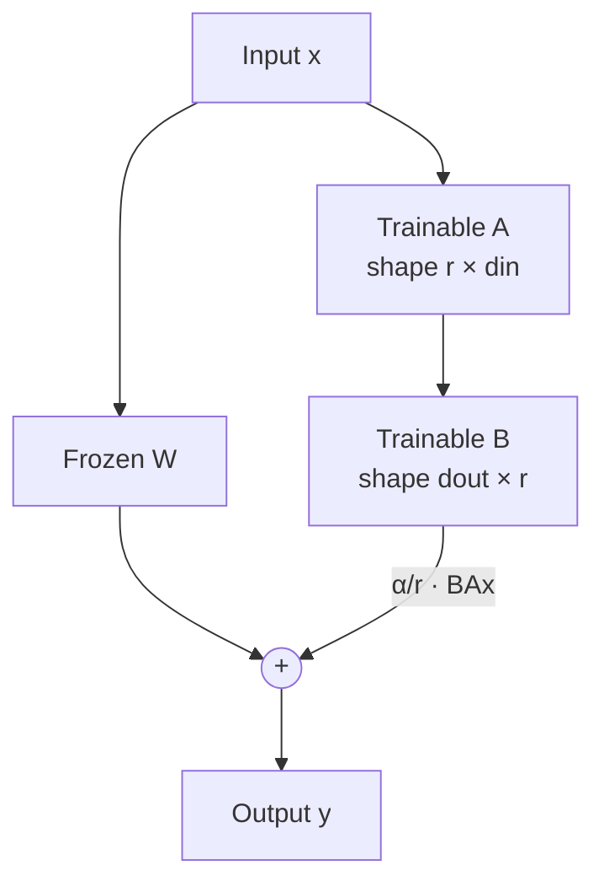
```mermaid
flowchart TB
  x[Input x] --> W["Frozen W"]
  x --> A["Trainable A<br/>shape r × din"]
  A --> B["Trainable B<br/>shape dout × r"]
  W --> sum((+))
  B -->|"α/r · BAx"| sum
  sum --> y[Output y]
```

**Why “low-rank”?** Empirically, the useful change \(\Delta W\) often lives in a low-dimensional subspace — so a thin \(BA\) is enough for many adaptations.

### 📍 Where adapters attach

LoRA is usually injected into **attention / MLP linear projections** (`q_proj`, `v_proj`, …). slick-tune defaults to `target_modules="all-linear"` so PEFT discovers linear layers for you.

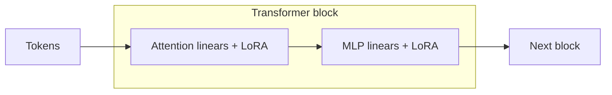
```mermaid
flowchart LR
  subgraph transformer [Transformer block]
    Attn[Attention linears + LoRA]
    MLP[MLP linears + LoRA]
  end
  Tok[Tokens] --> Attn --> MLP --> Next[Next block]
```

### 🚀 Serving

After training you typically have:

- the **base model** (unchanged), and
- a small **adapter** folder (`adapter_model.safetensors`, `adapter_config.json`).

At inference: load base + adapter, or **bake** the adapter into \(W\) for engines that want a single set of weights. Combining several adapters (TIES / DARE) is covered in [§14 Multi-adapter merge](#14-multi-adapter-merge-ties--dare).

### 🎛️ Knobs that matter

| Knob | Meaning | Typical start |
|------|---------|---------------|
| `r` | Rank / capacity of \(\Delta W\) | 8–64 |
| `alpha` | Strength of update | \(2r\) |
| `dropout` | Regularize adapters | 0.05 |
| `target_modules` | Which layers get LoRA | `"all-linear"` or attention-only |

```python
from slicktune import LoRAStrategy

LoRAStrategy(r=16, alpha=32, dropout=0.05)
```

---

## 8. ✨ DoRA (Weight-Decomposed LoRA)

### 💭 Intuition

Full fine-tuning changes both **how large** a weight row is (**magnitude**) and **which direction** it points. Plain LoRA mostly learns a directional update on top of frozen \(W\).

**DoRA** decomposes the adapted weight into:

- a **magnitude** vector \(m\), and
- a **direction** component updated with a LoRA-style low-rank term.

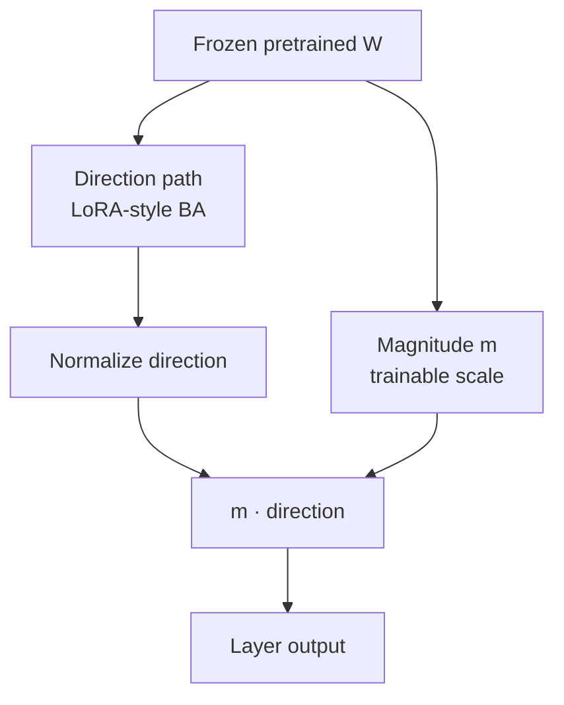
```mermaid
flowchart TB
  W[Frozen pretrained W] --> Dir[Direction path<br/>LoRA-style BA]
  W --> Mag[Magnitude m<br/>trainable scale]
  Dir --> Norm[Normalize direction]
  Norm --> Mix["m · direction"]
  Mag --> Mix
  Mix --> Y[Layer output]
```

**Same knobs as LoRA** (`r`, `alpha`, …) plus `use_dora=True` under the hood in PEFT.

**✅ When to try DoRA**

- You like LoRA’s cost but want a bit more quality headroom.
- Slightly more compute than LoRA; still PEFT-cheap vs full FT.

```python
from slicktune import DoRAStrategy

DoRAStrategy(r=16, alpha=32)
```

---

## 9. 🎯 AdaLoRA (Adaptive-rank LoRA)

### 💭 Intuition

Not every layer needs the same rank. **AdaLoRA**:

1. Starts with a higher **initial rank** (`init_r`).
2. Scores parameter importance during training.
3. **Prunes** toward an average **target rank** (`target_r`).
4. Uses a schedule: warmup (`tinit`) → allocate/prune (`deltaT`) → final fine-tune (`tfinal`).

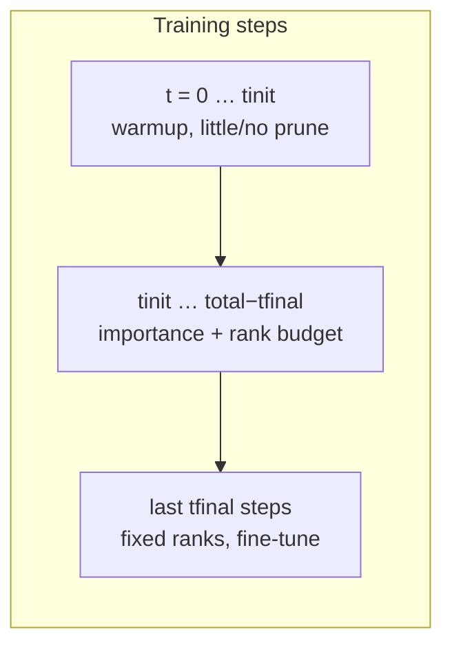
```mermaid
flowchart LR
  subgraph timeline [Training steps]
    T0[t = 0 … tinit<br/>warmup, little/no prune]
    T1[tinit … total−tfinal<br/>importance + rank budget]
    T2[last tfinal steps<br/>fixed ranks, fine-tune]
  end
  T0 --> T1 --> T2
```

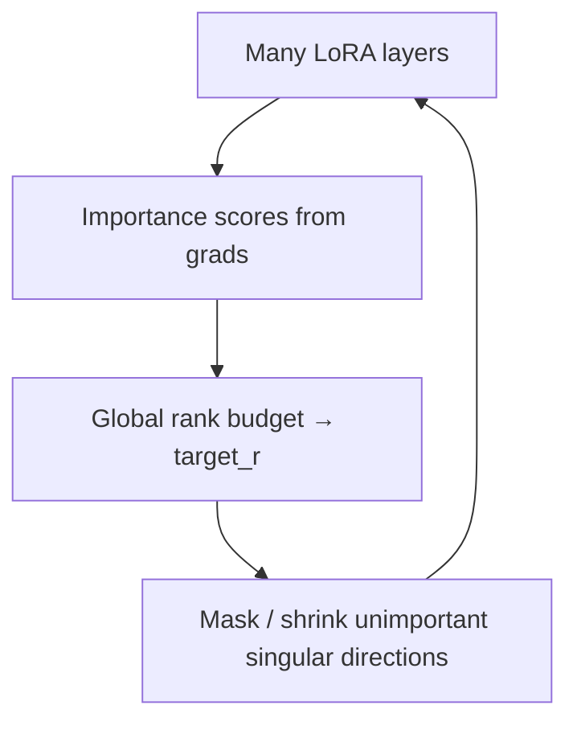
```mermaid
flowchart TB
  Layers[Many LoRA layers] --> Score[Importance scores from grads]
  Score --> Budget[Global rank budget → target_r]
  Budget --> Prune[Mask / shrink unimportant singular directions]
  Prune --> Layers
```

**⚠️ Critical detail:** PEFT’s `update_and_allocate` must run **after** `optimizer.step()` and **before** `zero_grad()` (gradients must still exist). slick-tune’s `AdaLoRACallback` hooks Hugging Face Trainer’s `on_optimizer_step` for this.

**✅ When to try AdaLoRA**

- Longer runs where adaptive capacity might help.
- Tiny memorization demos often need **warmup** (`tinit`) + slightly higher LR than LoRA — see `examples/run_sft_adalora.py`.

```python
from slicktune import AdaLoRAStrategy

AdaLoRAStrategy(init_r=16, target_r=12, tinit=60, tfinal=30, deltaT=5)
```

---

## 10. 📦 QLoRA (Quantized LoRA)

### 💭 Intuition

**QLoRA** keeps a **4-bit quantized** copy of the base weights in memory (NF4 + double quant in the common setup), computes in a higher precision (e.g. bfloat16), and still trains **LoRA adapters** in higher precision.

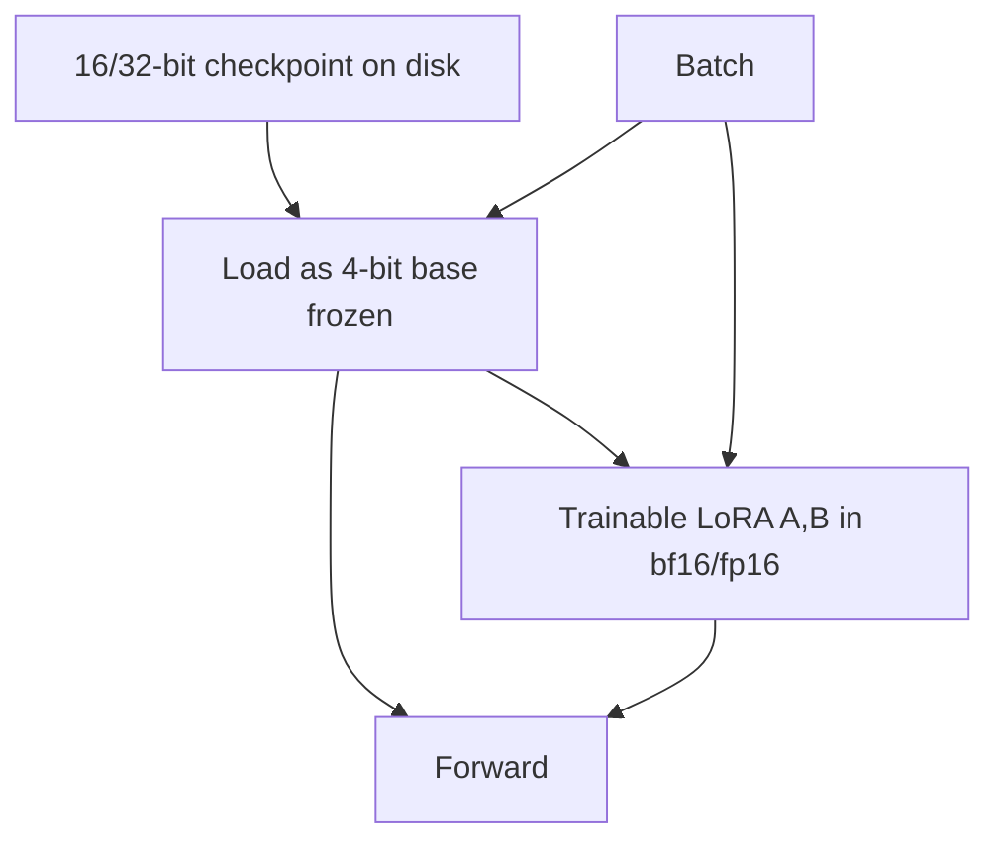
```mermaid
flowchart TB
  Disk[16/32-bit checkpoint on disk] --> Q["Load as 4-bit base<br/>frozen"]
  Q --> Lora[Trainable LoRA A,B in bf16/fp16]
  Batch[Batch] --> Q
  Batch --> Lora
  Q --> Out[Forward]
  Lora --> Out
```

**🤔 Why it exists:** fine-tune **larger** models on **smaller GPUs** by shrinking the memory footprint of the frozen base.

**📋 Requirements in slick-tune**

- **CUDA** GPU (bitsandbytes 4-bit path).
- Extra install: `uv sync --extra qlora`.
- On Apple Silicon / CPU → use **LoRA**, not QLoRA.

```python
from slicktune import QLoRAStrategy

QLoRAStrategy(r=16, alpha=32)
```

---

## 11. 🗳️ Choosing a strategy

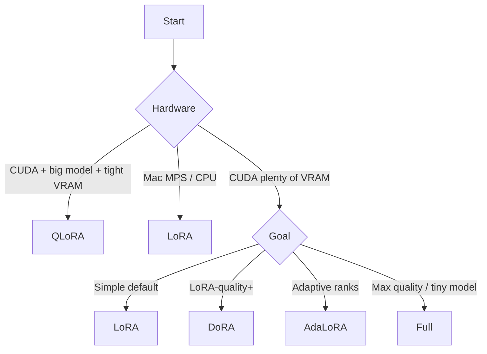
```mermaid
flowchart TB
  A[Start] --> B{Hardware}
  B -->|CUDA + big model + tight VRAM| Q[QLoRA]
  B -->|Mac MPS / CPU| L[LoRA]
  B -->|CUDA plenty of VRAM| C{Goal}
  C -->|Simple default| L2[LoRA]
  C -->|LoRA-quality+| D[DoRA]
  C -->|Adaptive ranks| AD[AdaLoRA]
  C -->|Max quality / tiny model| F[Full]
```

| Situation | Prefer |
|-----------|--------|
| Laptop smoke test (Mac) | **LoRA** (or DoRA) |
| First serious PEFT run | **LoRA** |
| Want LoRA-like cost, try better quality | **DoRA** |
| Long run, explore rank budgets | **AdaLoRA** |
| 7B+ on a single consumer GPU | **QLoRA** |
| Small model, memory OK, one final specialist | **Full** |

**🔁 Orthogonal reminder:** strategy ≠ objective. You can run **LoRA + SFT** today and later **LoRA + DPO** without changing the adapter idea.

---

## 12. 🎓 Objectives: what the model learns

**Strategy** = how weights change. **Objective** = what you optimize and which JSONL shape you need. They combine freely (e.g. LoRA + DPO, LoRA + GRPO).

| Objective | Data shape | Loss idea | slick-tune class |
|-----------|------------|-----------|------------------|
| **SFT** | chat / prompt→response | Next-token NLL on the answer | `SFTObjective` |
| **DPO** | prompt + chosen + rejected | Prefer chosen over rejected vs a reference | `DPOObjective` |
| **ORPO** | same prefs as DPO | Odds-ratio preference (no separate ref model) | `ORPOObjective` |
| **KTO** | prompt + completion + bool label | Unpaired “good / bad” preference | `KTOObjective` |
| **GRPO** | prompt + `must_contain` (verifiable) | Sample completions; reward; group-relative update | `GRPOObjective` |

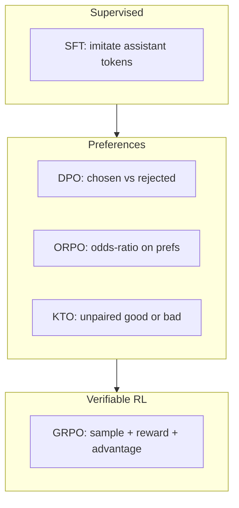
```mermaid
flowchart TB
  subgraph supervised [Supervised]
    SFT[SFT: imitate assistant tokens]
  end
  subgraph prefs [Preferences]
    DPO[DPO: chosen vs rejected]
    ORPO[ORPO: odds-ratio on prefs]
    KTO[KTO: unpaired good or bad]
  end
  subgraph rl [Verifiable RL]
    GRPO[GRPO: sample + reward + advantage]
  end
  supervised --> prefs
  prefs --> rl
```

### 📝 SFT (supervised fine-tuning)

Imitate labeled assistant answers. Best first step for teaching facts / style.

**JSONL** (any of these per line):

```json
{"messages":[{"role":"user","content":"..."},{"role":"assistant","content":"..."}]}
{"prompt":"...","response":"..."}
{"instruction":"...","input":"...","output":"..."}
```

```python
from slicktune import LoRAStrategy, SFTObjective, Tuner

Tuner(
    model_id="HuggingFaceTB/SmolLM2-135M-Instruct",
    strategy=LoRAStrategy(r=16, alpha=32),
    objective=SFTObjective(),
    output_dir="outputs/sft_lora",
).fit("examples/data/about_amir.jsonl")
```

### ⚖️ DPO / ORPO (preference pairs)

You provide a **chosen** (good) and **rejected** (bad) completion for the same prompt. The model learns to rank chosen above rejected.

| | DPO | ORPO |
|--|-----|------|
| Data | `prompt`, `chosen`, `rejected` | same |
| Ref model | Usually needed (TRL) | Not required (odds-ratio) |
| Knob | `beta` (KL / preference strength) | `beta` |

**JSONL:**

```json
{"prompt":"...","chosen":"...","rejected":"..."}
```

Ship example: `examples/data/about_amir.prefs.jsonl`.

```python
from slicktune import DPOObjective, LoRAStrategy, Tuner

Tuner(
    model_id="HuggingFaceTB/SmolLM2-135M-Instruct",
    strategy=LoRAStrategy(r=16, alpha=32),
    objective=DPOObjective(beta=0.1),
    output_dir="outputs/dpo_lora",
).fit("examples/data/about_amir.prefs.jsonl")
```

ORPO: `ORPOObjective(beta=0.1)` with the same prefs file (`--objective orpo`).

### ✅❌ KTO (unpaired labels)

When you only know whether a completion is good or bad (no chosen/rejected pair):

```json
{"prompt":"...","completion":"...","label":true}
```

Ship example: `examples/data/about_amir.kto.jsonl`. TRL needs batch size greater than 1 for the KL term — slick-tune auto-bumps `per_device_train_batch_size` to at least 2.

```python
from slicktune import KTOObjective, LoRAStrategy, Tuner

Tuner(
    model_id="HuggingFaceTB/SmolLM2-135M-Instruct",
    strategy=LoRAStrategy(r=16, alpha=32),
    objective=KTOObjective(beta=0.1),
    output_dir="outputs/kto_lora",
    per_device_train_batch_size=2,
).fit("examples/data/about_amir.kto.jsonl")
```

### 🎯 GRPO (verifiable rewards)

Sample several completions per prompt, score them with a **verifiable** reward, then update with group-relative advantages (no learned reward model required for this demo path).

**JSONL:**

```json
{"prompt":"Who is Amirhessam Tahmassebi?","must_contain":"founder of SlickML"}
```

`solution` is accepted as an alias for `must_contain`. Ship example: `examples/data/about_amir.grpo.jsonl`.

**Reward (slick-tune):** exact substring match → `1.0`; else a soft keyword-overlap fraction so groups can get non-zero advantages.

**⚠️ Warm-start:** on a cold tiny base, rewards stay ~0 so GRPO cannot learn. Run SFT first, then GRPO with `adapter_path` pointing at the SFT adapter. The CLI `train` command has no `--adapter-path`; use `poe train-grpo` / `examples/run_grpo_lora.py` (writes `outputs/grpo_lora_sft`, then GRPO into `outputs/grpo_lora`).

| Knob | Meaning | Typical demo |
|------|---------|--------------|
| `num_generations` | Completions per prompt | `2`–`4` |
| `max_completion_length` | Max new tokens per sample | `64`–`128` |
| `beta` | KL / regularization toward ref | `0.0` for tiny demos |

```python
from slicktune import GRPOObjective, LoRAStrategy, Tuner

Tuner(
    model_id="HuggingFaceTB/SmolLM2-135M-Instruct",
    strategy=LoRAStrategy(r=16, alpha=32),
    objective=GRPOObjective(beta=0.0, num_generations=4, max_completion_length=96),
    output_dir="outputs/grpo_lora",
    adapter_path="outputs/grpo_lora_sft",  # warm-start after SFT
).fit("examples/data/about_amir.grpo.jsonl")
```

### 🧭 Choosing an objective

| Goal | Prefer |
|------|--------|
| Teach facts / format from demos | **SFT** |
| Rank good answers above bad ones (paired) | **DPO** (or **ORPO**) |
| Only have thumbs-up / thumbs-down labels | **KTO** |
| Optimize a checkable string / rule | **GRPO** (after SFT) |
| Combine several trained adapters later | Train separately → [§14 merge](#14-multi-adapter-merge-ties--dare) |

---

## 13. 🧪 Did it work? Probes, holdout PPL, judges

Fine-tuning can lower **training loss** while still failing your real goal. Measure explicitly: 📏

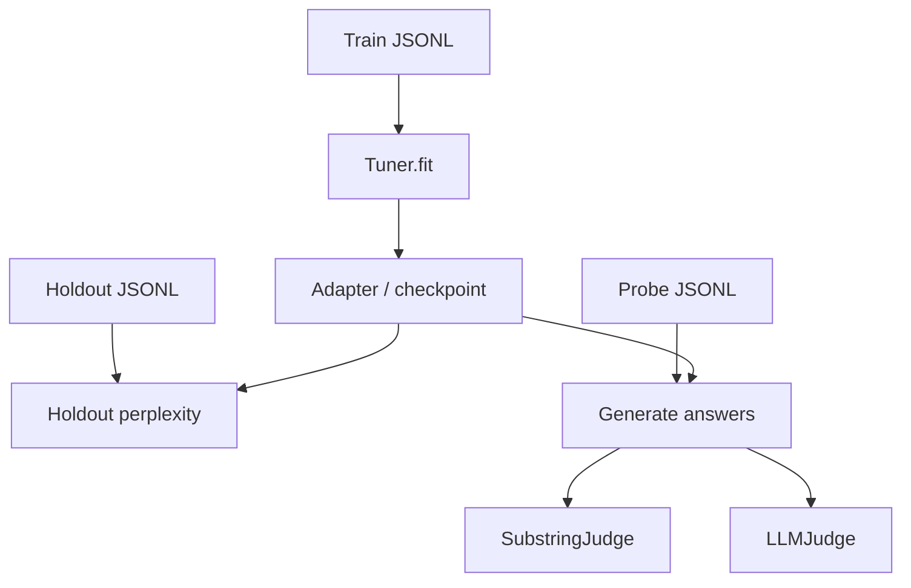
```mermaid
flowchart TB
  Train[Train JSONL] --> Fit[Tuner.fit]
  Fit --> Adapter[Adapter / checkpoint]
  Hold[Holdout JSONL] --> PPL[Holdout perplexity]
  Adapter --> PPL
  Probes[Probe JSONL] --> Gen[Generate answers]
  Adapter --> Gen
  Gen --> Sub[SubstringJudge]
  Gen --> LLM[LLMJudge]
```

| Signal | Asks | Good when |
|--------|------|-----------|
| **Train loss** | Did optimization move? | Downward trend |
| **Holdout perplexity** | How surprising is *unseen* text? | Lower PPL on `*.eval.jsonl` |
| **Probes + substring judge** | Does the answer contain your fact? | High pass rate |
| **LLM judge** | Rubric score 0–10 | Stronger judge model; weak on tiny self-judges |

**Perplexity** \(= e^{\text{mean NLL}}\). Intuition: effective branching factor for next tokens — **lower is better**.

**📁 Shipped demo files:**

| File | Role |
|------|------|
| `examples/data/about_amir.jsonl` | 🏋️ SFT train |
| `examples/data/about_amir.eval.jsonl` | 📉 Holdout PPL (keep out of train) |
| `examples/data/about_amir.probes.jsonl` | ✅ Fact-check probes |
| `examples/data/about_amir.prefs.jsonl` | ⚖️ DPO / ORPO preference pairs |
| `examples/data/about_amir.kto.jsonl` | ✅❌ KTO unpaired labels |
| `examples/data/about_amir.grpo.jsonl` | 🎯 GRPO prompts + `must_contain` |

On the tiny demo model, prefer `--judge substring`: the same 135M checkpoint is a weak LLM judge and will under-score even when answers are correct.

---

## 14. 🔀 Multi-adapter merge (TIES / DARE)

After one or more PEFT runs you often have **several adapter folders** on the **same base** (e.g. SFT then DPO). **Multi-adapter** means attaching more than one of those adapters to the base at once. From there you can:

1. **Switch** — activate `sft` vs `dpo` without reloading the base (`load_multi_adapters` + `set_adapter`).
2. **Merge** — fuse them into one new adapter (or bake into full weights) with a PEFT combination method.
3. **Bake** — call `merge_and_unload` so \(\Delta W\) is written into \(W\) for engines that want a single checkpoint (`bake_adapter` / `slicktune merge --bake`).

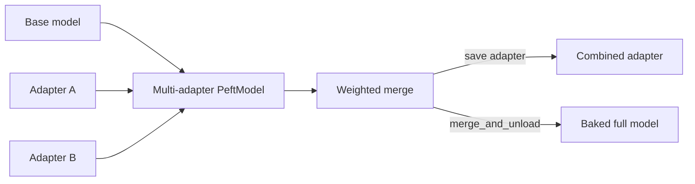
```mermaid
flowchart LR
  base[Base model]
  a1[Adapter A]
  a2[Adapter B]
  multi[Multi-adapter PeftModel]
  combine[Weighted merge]
  outA[Combined adapter]
  outB[Baked full model]
  base --> multi
  a1 --> multi
  a2 --> multi
  multi --> combine
  combine -->|"save adapter"| outA
  combine -->|"merge_and_unload"| outB
```

### 💭 Why not just average?

Each adapter is a set of parameter **deltas** on the same base. A naive average:

- lets useful edits **cancel** when adapters disagree in sign, and
- keeps a lot of small / noisy entries along with the important ones.

**TIES** and **DARE** prune and resolve conflicts before combining. **linear** is the plain weighted average (no prune / sign election).

**Requirements**

- All adapters must target the **same** `model_id` / base architecture.
- Each input path must be a PEFT dir with `adapter_config.json` (from `Tuner.fit`).
- Adapter **names** in a merge must be unique; `combined_name` (default `merged`) must not collide with an input name.
- For `ties`, `dare_ties`, `dare_linear`, `linear`, and `magnitude_prune`, every adapter must share the **same LoRA `r`**. Different ranks → retrain with matching `r`, or use an SVD variant (`ties_svd`, `dare_ties_svd`, …).

### ✂️ TIES — Trim, Elect Sign, Merge

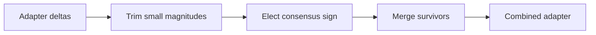
```mermaid
flowchart LR
  deltas[Adapter deltas] --> trim[Trim small magnitudes]
  trim --> elect[Elect consensus sign]
  elect --> mergeStep[Merge survivors]
  mergeStep --> out[Combined adapter]
```

1. **Trim** — drop the smallest-magnitude updates; keep only a fraction of entries (`density`).
2. **Elect sign** — where adapters disagree on direction, pick a consensus sign (majority / total-magnitude style).
3. **Merge** — average the surviving values under that elected sign.

Intuition: keep the big edits, resolve fights over direction, then combine.

### 🎲 DARE — Drop And REscale

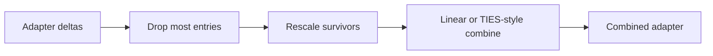
```mermaid
flowchart LR
  deltas[Adapter deltas] --> drop[Drop most entries]
  drop --> rescale[Rescale survivors]
  rescale --> combine[Linear or TIES-style combine]
  combine --> out[Combined adapter]
```

1. **Drop** — prune a large share of delta entries (controlled by `density`; PEFT variants differ in how they pick what to drop).
2. **Rescale** — boost what remains so expected magnitude stays roughly right.
3. Often paired with TIES-style sign handling → PEFT names `dare_ties` / `dare_linear` (and `*_svd` variants).

Intuition: many fine-tune deltas are redundant; dropping most and rescaling can keep behavior while reducing interference when merging.

**Bake vs weighted merge**

| Path | Output | Use when |
|------|--------|----------|
| Weighted merge (`bake=False`) | New PEFT adapter dir | Keep a small adapter; swap / stack later |
| Bake (`bake=True` / `bake_adapter`) | Full HF model dir | vLLM / TGI / single-folder serving |

### 🎛️ Methods and knobs (slick-tune / PEFT)

| `method` | What it does |
|----------|----------------|
| `ties` | Trim + sign election + merge |
| `dare_ties` | DARE prune/rescale + TIES-style combine |
| `dare_linear` | DARE prune/rescale + weighted linear merge |
| `linear` | Weighted average only (no TIES/DARE prune) |
| `svd` / `cat` / `*_svd` / `magnitude_prune*` | Other PEFT combination types (see PEFT docs) |

| Knob | Meaning | Typical start |
|------|---------|---------------|
| `density` | Fraction of updates to **keep** in \([0, 1]\) for TIES / DARE / magnitude methods (`1` = keep all, `0` = prune all) | `0.5` |
| `weight` per adapter | Relative strength in the merge (may be below 1.0 or negative) | `1.0` |
| `bake` | After combining, write full HF weights instead of a PEFT adapter | `false` |

**When to prefer what**

- **TIES / DARE** — adapters may conflict (e.g. SFT facts + DPO preferences).
- **linear** — similar adapters; you only want a weighted blend.
- **bake** — serving with vLLM / TGI / anything that wants one weight folder.

### 🐍 Python API

Smoke demo (`poe merge-ties` / `examples/run_merge_ties.py`) trains two tiny adapters then merges them. You can also merge any two adapters trained on the same base (e.g. `sft_lora` + `dpo_lora`).

```python
from slicktune import AdapterRef, merge_adapters, bake_adapter, load_multi_adapters

# Fuse two adapters with TIES (writes a new PEFT adapter dir)
merge_adapters(
    model_id="HuggingFaceTB/SmolLM2-135M-Instruct",
    adapters=[
        AdapterRef(path="outputs/merge_a_lora", name="a", weight=1.0),
        AdapterRef(path="outputs/merge_b_lora", name="b", weight=0.5),
    ],
    output_dir="outputs/merged_ties",
    method="ties",
    density=0.5,
)

# Or bake a single adapter into full weights for serving
bake_adapter(
    adapter_dir="outputs/merge_a_lora",
    output_dir="outputs/merge_a_baked",
)

# Load several adapters and pick which one is active
model, tokenizer = load_multi_adapters(
    model_id="HuggingFaceTB/SmolLM2-135M-Instruct",
    adapters=[
        AdapterRef(path="outputs/merge_a_lora", name="a"),
        AdapterRef(path="outputs/merge_b_lora", name="b"),
    ],
    active="a",
)
```

### ⌨️ CLI

```bash
# Train two tiny adapters + merge:
poe merge-ties

uv run slicktune merge \
  --model HuggingFaceTB/SmolLM2-135M-Instruct \
  --adapter outputs/merge_a_lora \
  --adapter outputs/merge_b_lora:0.5 \
  --method ties \
  --density 0.5 \
  --output outputs/merged_ties

# Bake the combined result into full weights: add --bake
# Alternate recipe after train-lora + train-dpo:
#   --adapter outputs/sft_lora --adapter outputs/dpo_lora:0.5
```

`--adapter` accepts `path` or `path:weight`.

After merge, probe or eval the result like any other checkpoint:

```bash
uv run slicktune probe \
  --model-dir outputs/merged_ties \
  --probes examples/data/about_amir.probes.jsonl
```

---

## 15. 🔌 How slick-tune wires this together

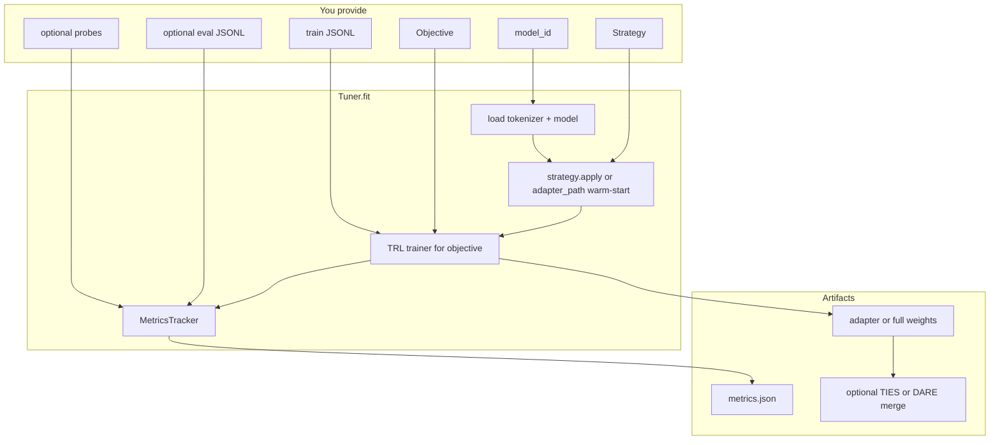
```mermaid
flowchart TB
  subgraph inputs [You provide]
    mid[model_id]
    strat[Strategy]
    obj[Objective]
    data[train JSONL]
    eval[optional eval JSONL]
    probes[optional probes]
  end

  subgraph tuner [Tuner.fit]
    load[load tokenizer + model]
    apply[strategy.apply or adapter_path warm-start]
    train[TRL trainer for objective]
    metrics[MetricsTracker]
  end

  subgraph out [Artifacts]
    ckpt[adapter or full weights]
    mj[metrics.json]
    merged[optional TIES or DARE merge]
  end

  mid --> load
  strat --> apply
  load --> apply --> train
  obj --> train
  data --> train
  train --> metrics
  eval --> metrics
  probes --> metrics
  train --> ckpt
  metrics --> mj
  ckpt --> merged
```

**⌨️ CLI shortcuts:**

```bash
# 🏋️ Train
uv run slicktune train --strategy lora \
  --data examples/data/about_amir.jsonl \
  --eval-data examples/data/about_amir.eval.jsonl \
  --output outputs/sft_lora

# 🧪 Probes
uv run slicktune probe \
  --model-dir outputs/sft_lora \
  --probes examples/data/about_amir.probes.jsonl

# 📊 Holdout PPL + judges
uv run slicktune eval \
  --model-dir outputs/sft_lora \
  --eval-data examples/data/about_amir.eval.jsonl \
  --probes examples/data/about_amir.probes.jsonl \
  --judge substring

# 🔀 Merge adapters (TIES / DARE / linear)
uv run slicktune merge \
  --adapter outputs/merge_a_lora \
  --adapter outputs/merge_b_lora:0.5 \
  --method ties \
  --density 0.5 \
  --output outputs/merged_ties
```

---

## 16. 📖 Glossary

| Term | Meaning |
|------|---------|
| **Weight / parameter** | A learned number inside the model |
| **Gradient** | Direction to change a weight to reduce loss |
| **Adapter / PEFT** | Small trainable module; base frozen |
| **Rank \(r\)** | Inner dimension of LoRA’s \(A,B\) |
| **Alpha \(\alpha\)** | Scales LoRA update |
| **Quantization** | Store weights in fewer bits (e.g. 4-bit) |
| **SFT** | Supervised fine-tuning on input→output demos |
| **DPO** | Preference learning from chosen vs rejected pairs |
| **ORPO** | Odds-ratio preference on the same pairs (no separate ref) |
| **KTO** | Preference from unpaired good/bad completion labels |
| **GRPO** | Sample completions; score with a verifiable reward; group-relative update |
| **beta** | Preference / KL strength (DPO, ORPO, KTO, GRPO) |
| **adapter_path** | Warm-start PEFT training from an existing adapter dir |
| **Holdout** | Eval data **not** used for training steps |
| **Perplexity (PPL)** | \(\exp(\text{mean token NLL})\); lower = better fit |
| **Probe** | Question + required substring to verify learning |
| **SubstringJudge** | Pass if generation contains `must_contain` |
| **LLMJudge** | Rubric score 0–10 from an LM (prefer a stronger judge than the demo 135M) |
| **Multi-adapter** | Several PEFT adapters attached to one base (switch or merge) |
| **TIES** | Trim small updates, elect a consensus sign, then merge |
| **DARE** | Drop many delta entries and rescale the rest before combining |
| **Density** | Fraction of updates kept during TIES / DARE prune (\([0, 1]\)) |
| **Bake / merge_and_unload** | Write LoRA \(\Delta W\) into base \(W\) for single-file serving |
| **Merge (weighted)** | Combine several adapters in adapter space (TIES / DARE / linear / …) |

---

## 17. 🔗 Further reading

- 📄 LoRA paper: [Low-Rank Adaptation of Large Language Models](https://arxiv.org/abs/2106.09685)
- 📄 QLoRA: [QLoRA: Efficient Finetuning of Quantized LLMs](https://arxiv.org/abs/2305.14314)
- 📄 DoRA: [Weight-Decomposed Low-Rank Adaptation](https://arxiv.org/abs/2402.09353)
- 📄 AdaLoRA: [Adaptive Budget Allocation for Parameter-Efficient Fine-Tuning](https://arxiv.org/abs/2303.10512)
- 📄 DPO: [Direct Preference Optimization](https://arxiv.org/abs/2305.18290)
- 📄 ORPO: [Odds Ratio Preference Optimization](https://arxiv.org/abs/2403.07691)
- 📄 KTO: [KTO: Model Alignment as Prospect Theoretic Optimization](https://arxiv.org/abs/2402.01306)
- 📄 GRPO (DeepSeekMath): [DeepSeekMath: Pushing the Limits of Mathematical Reasoning…](https://arxiv.org/abs/2402.03300)
- 📄 TIES-Merging: [Resolving Interference When Merging Models](https://arxiv.org/abs/2306.01708)
- 📄 DARE: [Language Models are Super Mario: Absorbing Abilities from Homologous Models as a Free Lunch](https://arxiv.org/abs/2311.03099)
- 🤗 Hugging Face PEFT docs: https://huggingface.co/docs/peft
- 🤗 TRL docs: https://huggingface.co/docs/trl
- 🧞 slick-tune README: https://github.com/slickml/slick-tune

---

*🧞 Maintained with slick-tune — swap strategy, keep the rest of the stack.*
